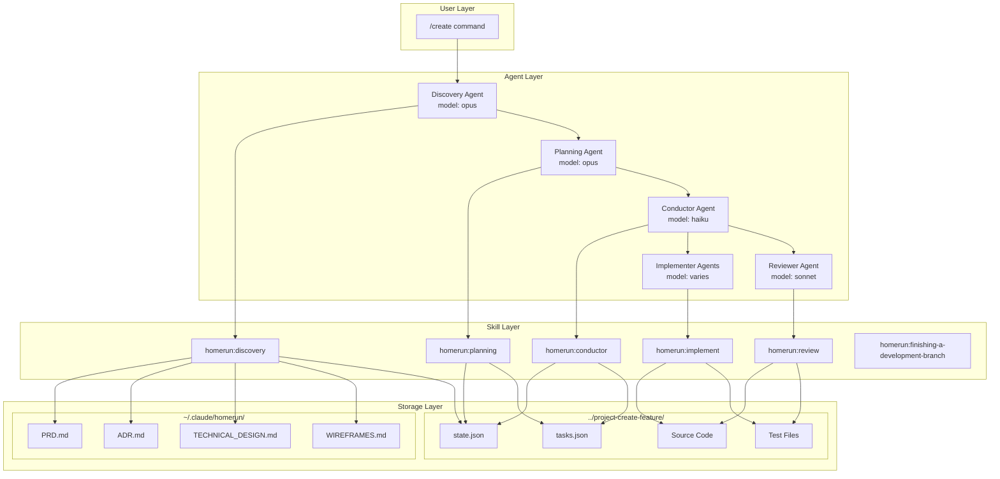
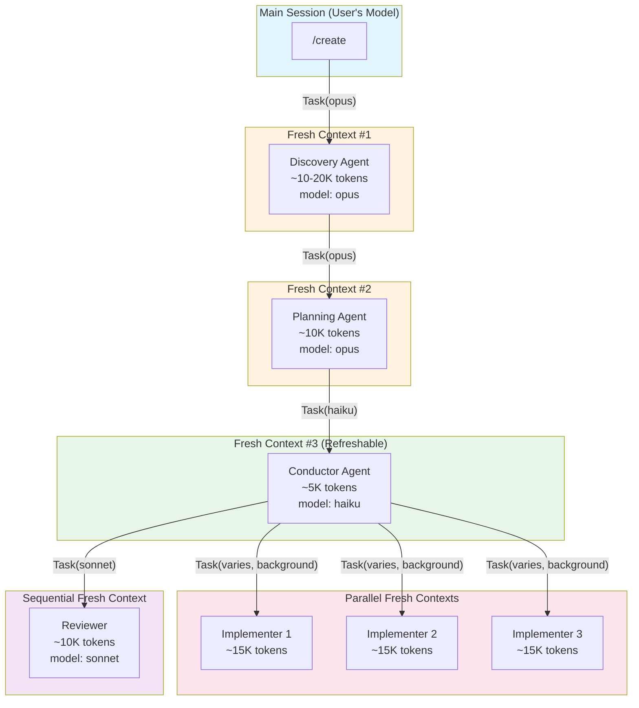
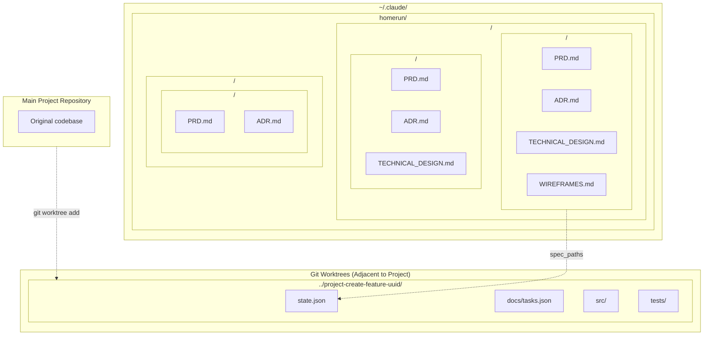
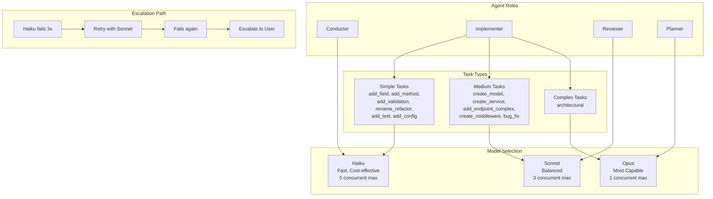
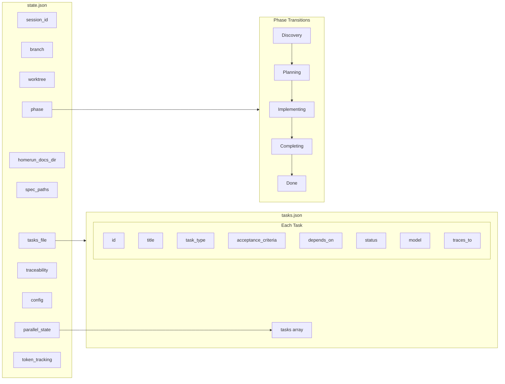
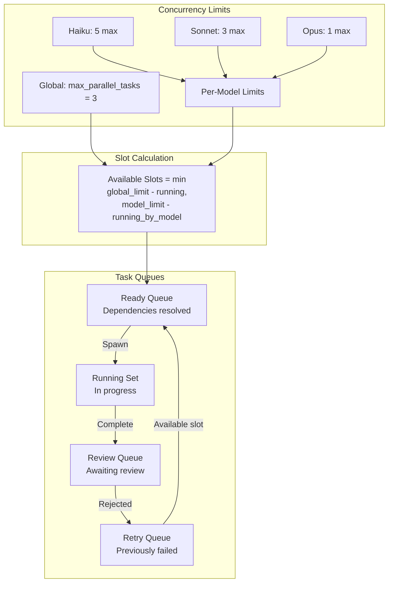

# Architecture Diagrams

## System Overview



## Component Relationships

```mermaid
graph LR
    subgraph Commands
        Create[/create]
    end

    subgraph Core Skills
        Discovery
        Planning
        Conductor
        Implement
        Review
    end

    subgraph Reference Skills
        TDD[test-driven-development]
        Worktree[using-git-worktrees]
        Debug[systematic-debugging]
        Finish[finishing-a-development-branch]
    end

    subgraph Reference Docs
        CE[context-engineering.md]
        SM[state-machine.md]
        RP[retry-patterns.md]
        MR[model-routing.json]
        TE[token-estimation.md]
    end

    Create --> Discovery
    Discovery --> Planning
    Planning --> Conductor
    Conductor --> Implement
    Conductor --> Review
    Conductor --> Finish

    Implement -.-> TDD
    Discovery -.-> Worktree
    Implement -.-> Debug

    Conductor -.-> CE
    Conductor -.-> SM
    Conductor -.-> RP
    Planning -.-> MR
    Conductor -.-> TE
```

## Agent Spawning Architecture



## File System Architecture



## Model Routing Architecture



## State Management Architecture



## Concurrency Model


