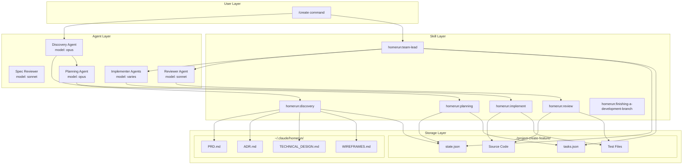
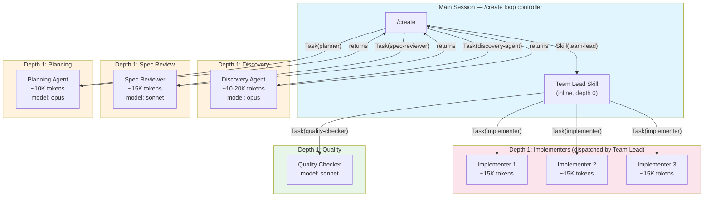
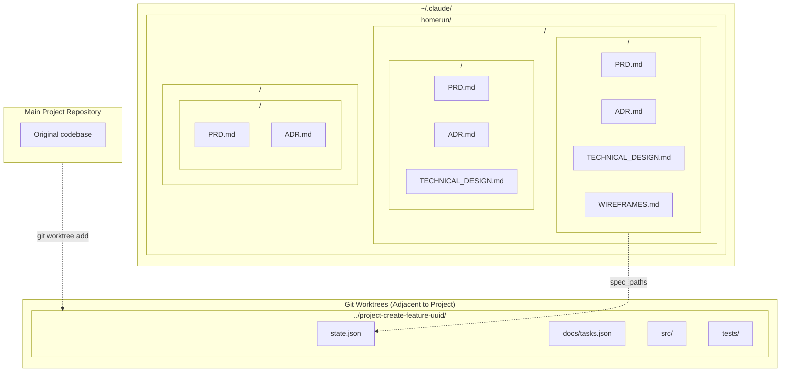
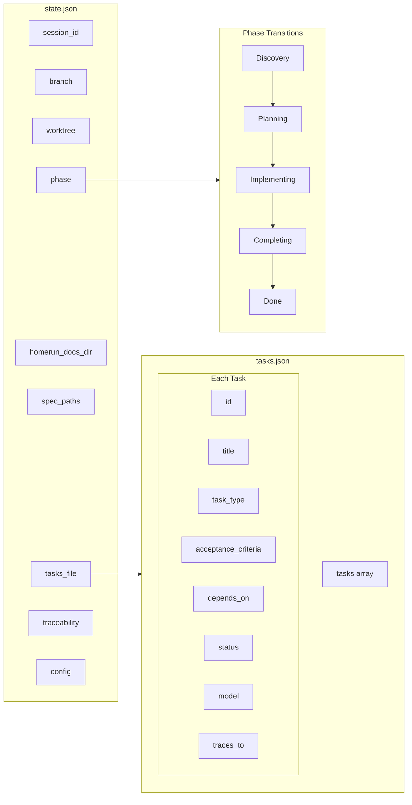

# Architecture Diagrams

## System Overview

```mermaid
graph TB
    subgraph User["User Layer"]
        CLI["/create command"]
    end

    subgraph Agents["Agent Layer"]
        D[Discovery Agent<br/>model: opus]
        SRv[Spec Reviewer<br/>model: sonnet]
        P[Planning Agent<br/>model: opus]
        I[Implementer Agents<br/>model: varies]
        R[Reviewer Agent<br/>model: sonnet]
    end

    subgraph Skills["Skill Layer"]
        SD[homerun:discovery]
        SP[homerun:planning]
        STL[homerun:team-lead]
        SI[homerun:implement]
        SR[homerun:review]
        SF[homerun:finishing-a-development-branch]
    end

    subgraph Storage["Storage Layer"]
        subgraph Centralized["~/.claude/homerun/"]
            PRD[PRD.md]
            ADR[ADR.md]
            TD[TECHNICAL_DESIGN.md]
            WF[WIREFRAMES.md]
        end
        subgraph Worktree["../project-create-feature/"]
            State[state.json]
            Tasks[tasks.json]
            Code[Source Code]
            Tests[Test Files]
        end
    end

    CLI --> D
    D --> SD
    D --> P
    P --> SP
    CLI --> STL
    STL --> I
    STL --> R
    I --> SI
    R --> SR

    SD --> PRD
    SD --> ADR
    SD --> TD
    SD --> WF
    SD --> State

    SP --> State
    SP --> Tasks

    STL --> State
    STL --> Tasks

    SI --> Code
    SI --> Tests

    SR --> Code
    SR --> Tests
```

## Component Relationships

```mermaid
graph LR
    subgraph Commands
        Create[/create]
    end

    subgraph Core Skills
        Discovery
        Planning
        TeamLead[Team Lead]
        Implement
        Review
    end

    subgraph Reference Skills
        TDD[test-driven-development]
        Worktree[using-git-worktrees]
        Debug[systematic-debugging]
        Finish[finishing-a-development-branch]
        QualityGates[setup-quality-gates]
    end

    subgraph Reference Docs
        CE[context-engineering.md]
        HC[hooks-configuration.md]
        RP[retry-patterns.md]
        MR[model-routing.json]
    end

    Create --> Discovery
    Discovery --> Planning
    Planning --> TeamLead
    TeamLead --> Implement
    TeamLead --> Review
    TeamLead --> Finish

    Implement -.-> TDD
    Discovery -.-> Worktree
    Implement -.-> Debug
    TeamLead -.-> QualityGates

    TeamLead -.-> CE
    Planning -.-> MR
```

## Agent Spawning Architecture

Phases run at **depth 0-1** (flat state machine). The team-lead skill runs inline at depth 0, dispatching implementers at depth 1.

```mermaid
graph TB
    subgraph Main["Main Session — /create loop controller"]
        Entry["/create"]
        TeamLead["Team Lead Skill<br/>(inline, depth 0)"]
    end

    subgraph Depth1_Discovery["Depth 1: Discovery"]
        D[Discovery Agent<br/>~10-20K tokens<br/>model: opus]
    end

    subgraph Depth1_SpecReview["Depth 1: Spec Review"]
        SR[Spec Reviewer<br/>~15K tokens<br/>model: sonnet]
    end

    subgraph Depth1_Planning["Depth 1: Planning"]
        P[Planning Agent<br/>~10K tokens<br/>model: opus]
    end

    subgraph Depth1_Impl["Depth 1: Implementers (dispatched by Team Lead)"]
        I1[Implementer 1<br/>~15K tokens]
        I2[Implementer 2<br/>~15K tokens]
        I3[Implementer 3<br/>~15K tokens]
    end

    subgraph Depth1_QC["Depth 1: Quality"]
        QC[Quality Checker<br/>model: sonnet]
    end

    Entry -->|"Task(discovery-agent)"| D
    D -->|"returns"| Entry
    Entry -->|"Task(spec-reviewer)"| SR
    SR -->|"returns"| Entry
    Entry -->|"Task(planner)"| P
    P -->|"returns"| Entry
    Entry -->|"Skill(team-lead)"| TeamLead
    TeamLead -->|"Task(implementer)"| I1
    TeamLead -->|"Task(implementer)"| I2
    TeamLead -->|"Task(implementer)"| I3
    TeamLead -->|"Task(quality-checker)"| QC

    style Main fill:#e1f5fe
    style Depth1_Discovery fill:#fff3e0
    style Depth1_SpecReview fill:#fff3e0
    style Depth1_Planning fill:#fff3e0
    style Depth1_Impl fill:#fce4ec
    style Depth1_QC fill:#e8f5e9
```

## File System Architecture

```mermaid
graph TB
    subgraph Home["~/.claude/"]
        subgraph Homerun["homerun/"]
            subgraph Project1["<project-hash-1>/"]
                subgraph Feature1["<feature-slug-uuid>/"]
                    PRD1[PRD.md]
                    ADR1[ADR.md]
                    TD1[TECHNICAL_DESIGN.md]
                    WF1[WIREFRAMES.md]
                end
                subgraph Feature2["<feature-slug-uuid>/"]
                    PRD2[PRD.md]
                    ADR2[ADR.md]
                    TD2[TECHNICAL_DESIGN.md]
                end
            end
            subgraph Project2["<project-hash-2>/"]
                subgraph Feature3["<feature-slug-uuid>/"]
                    PRD3[PRD.md]
                    ADR3[ADR.md]
                end
            end
        end
    end

    subgraph Worktrees["Git Worktrees (Adjacent to Project)"]
        subgraph WT1["../project-create-feature-uuid/"]
            State1[state.json]
            Tasks1[docs/tasks.json]
            Src1[src/]
            Test1[tests/]
        end
    end

    subgraph MainRepo["Main Project Repository"]
        Main[Original codebase]
    end

    MainRepo -.->|"git worktree add"| WT1
    Feature1 -.->|"spec_paths"| State1
```

## State Management Architecture

```mermaid
graph LR
    subgraph StateJSON["state.json"]
        Session[session_id]
        Branch[branch]
        WT[worktree]
        Phase[phase]
        DocDir[homerun_docs_dir]
        SpecPaths[spec_paths]
        TasksFile[tasks_file]
        Trace[traceability]
        Config[config]
    end

    subgraph TasksJSON["tasks.json"]
        TaskList[tasks array]
        subgraph Task["Each Task"]
            TID[id]
            Title[title]
            Type[task_type]
            AC[acceptance_criteria]
            Deps[depends_on]
            Status[status]
            Model[model]
            TracesTo[traces_to]
        end
    end

    subgraph Phases["Phase Transitions"]
        Discovery --> Planning
        Planning --> Implementing
        Implementing --> Completing
        Completing --> Done
    end

    Phase --> Phases
    TasksFile --> TasksJSON
```
