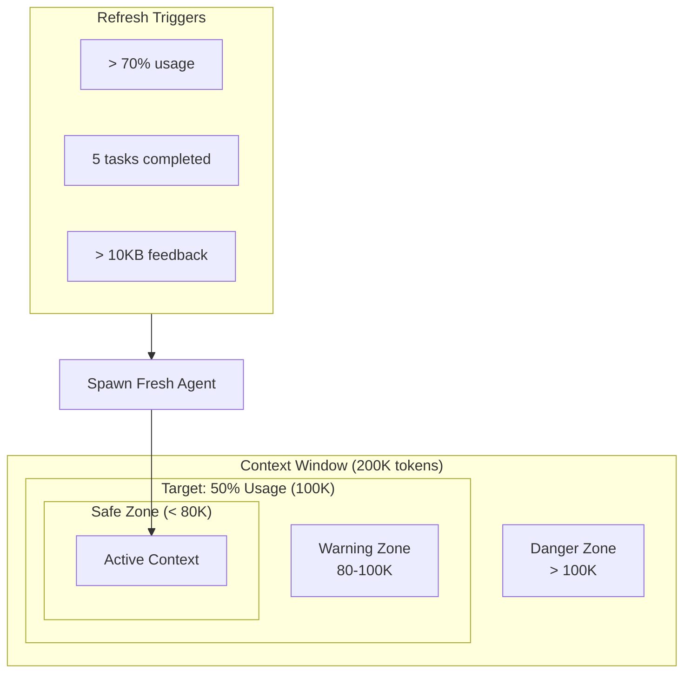
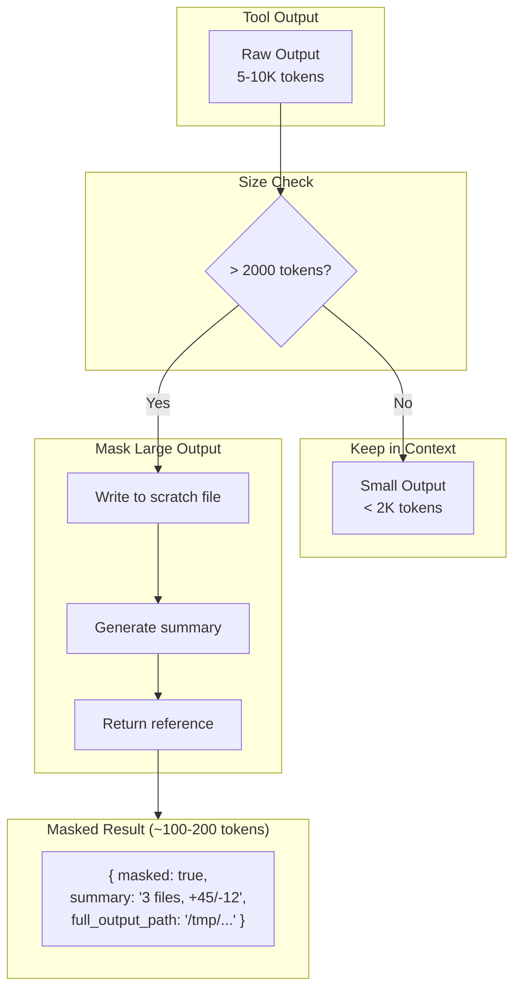
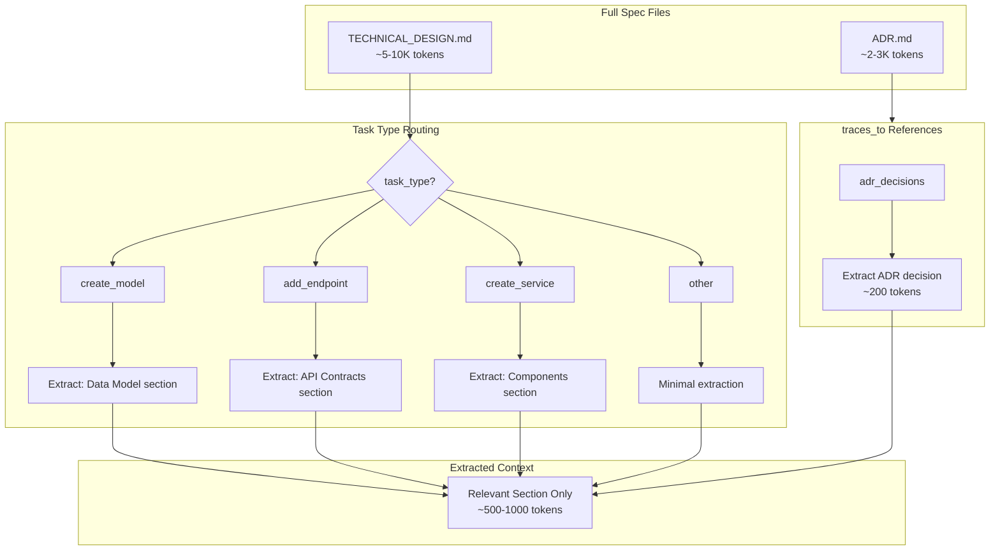
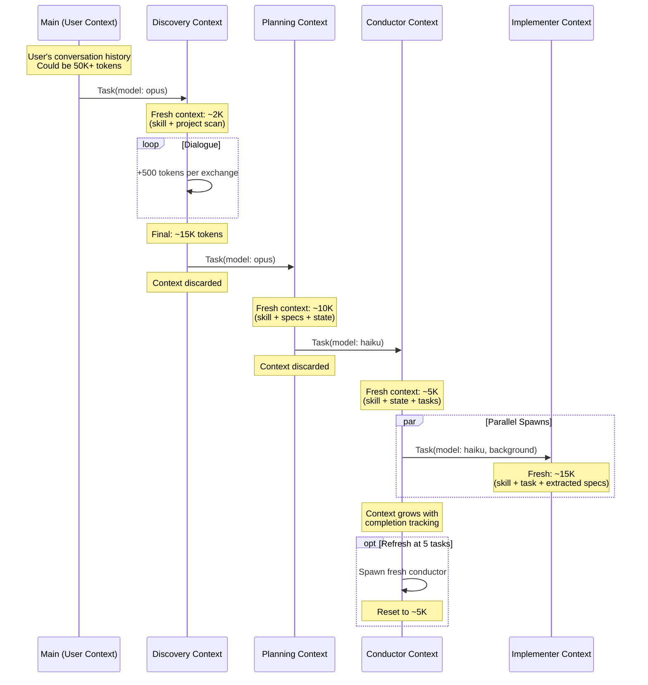
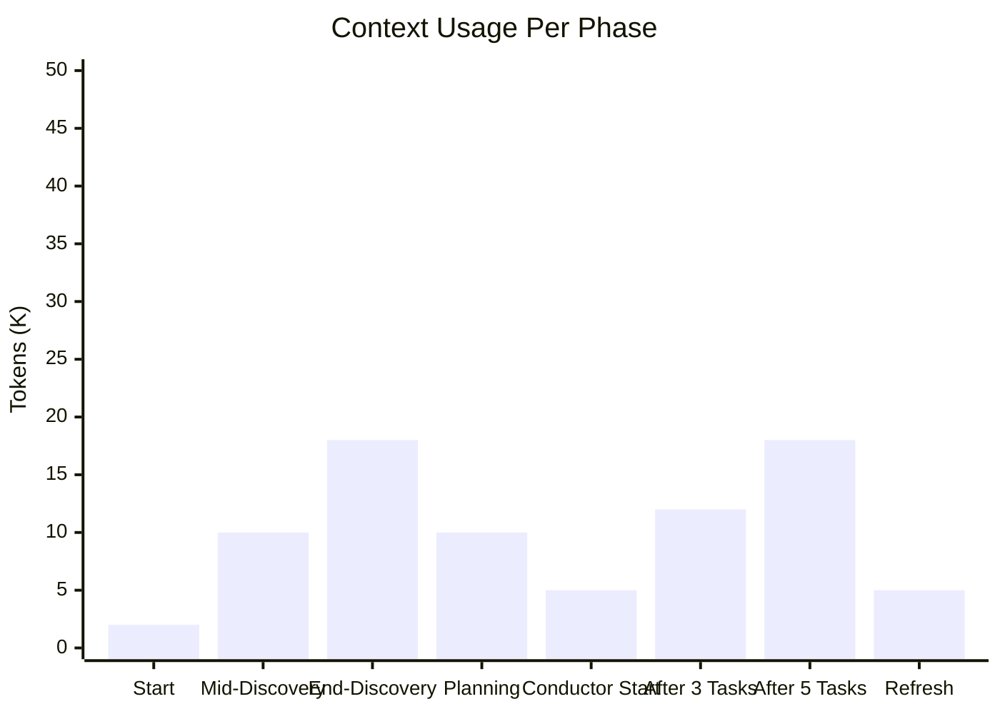
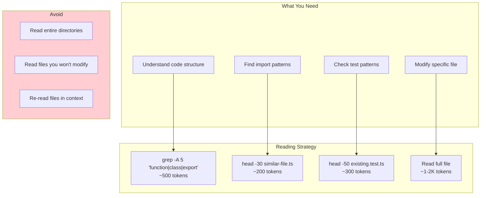

# Context Flow Diagrams

## Token Budget Flow



## Per-Phase Context Budgets

```mermaid
graph LR
    subgraph Discovery["Discovery (~10-20K)"]
        D1[Skill: 2K]
        D2[Project context: 2K]
        D3[Dialogue: 10K growing]
        D4[Spec drafts: 5K]
    end

    subgraph Planning["Planning (~10K)"]
        P1[Skill: 3K]
        P2[Specs: 5K]
        P3[State: 1K]
        P4[Tasks output: 2K]
    end

    subgraph Conductor["Conductor (~5K)"]
        C1[Skill: 2K]
        C2[State: 1K]
        C3[Current tasks: 1K]
        C4[Feedback buffer: 1K]
    end

    subgraph Implementer["Implementer (~15K target)"]
        I1[Skill: 1K]
        I2[Task: 1K]
        I3[Extracted specs: 1K]
        I4[File reads: 3K]
        I5[Test output: 0.5K masked]
        I6[Implementation: 5K]
        I7[Buffer: 3.5K]
    end

    subgraph Reviewer["Reviewer (~10K)"]
        R1[Skill: 1K]
        R2[Task: 1K]
        R3[Specs: 2K]
        R4[Implementation: 4K]
        R5[Analysis: 2K]
    end

    Discovery -->|"Task(opus)"| Planning
    Planning -->|"Task(haiku)"| Conductor
    Conductor -->|"Task(varies)"| Implementer
    Conductor -->|"Task(sonnet)"| Reviewer
```



## Observation Masking Flow



## Spec Extraction Flow



## Agent Spawning with Context Isolation



## Context Accumulation Over Time



## Test Output Masking Example

```
BEFORE MASKING (5000+ tokens):
─────────────────────────────────────────────
PASS src/models/user.test.ts
  User Model
    ✓ should create user with valid email (3ms)
    ✓ should hash password on creation (15ms)
    ✓ should validate email format (2ms)
    ✓ should reject weak passwords (1ms)
    ... 50 more passing tests ...

FAIL src/services/auth.test.ts
  Auth Service
    ✓ should login with valid credentials (5ms)
    ✕ should reject invalid password (3ms)

      Expected: 401
      Received: 200

      at Object.<anonymous> (src/services/auth.test.ts:45:21)
      at processTicksAndRejections (node:internal/process/task_queues:95:5)

    ... stack trace continues for 30 lines ...

Test Suites: 1 failed, 5 passed, 6 total
Tests:       1 failed, 54 passed, 55 total
Time:        2.345s
─────────────────────────────────────────────

AFTER MASKING (~200 tokens):
─────────────────────────────────────────────
{
  "masked": true,
  "summary": "54 passed, 1 failed",
  "first_failure": {
    "test": "should reject invalid password",
    "file": "src/services/auth.test.ts:45",
    "expected": 401,
    "received": 200
  },
  "full_output_path": "/tmp/claude-scratch/test-1706195400.txt"
}
─────────────────────────────────────────────
```

## File Read Strategy


