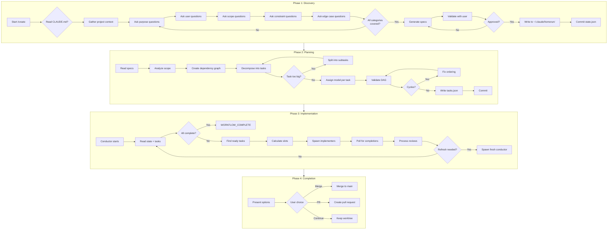
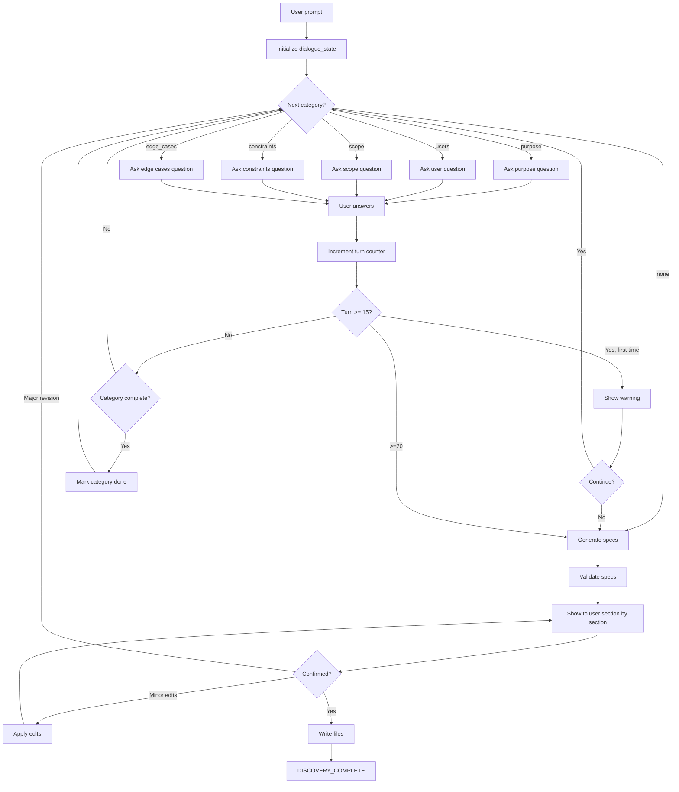
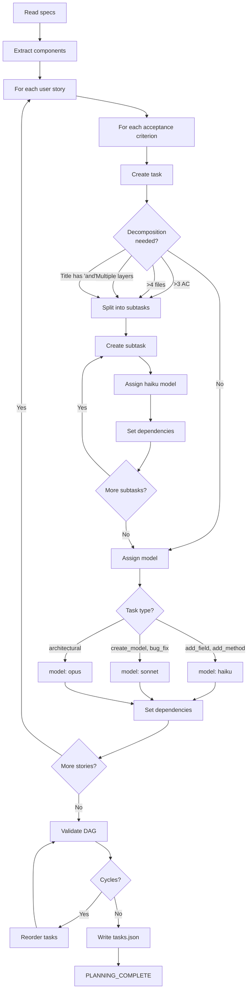
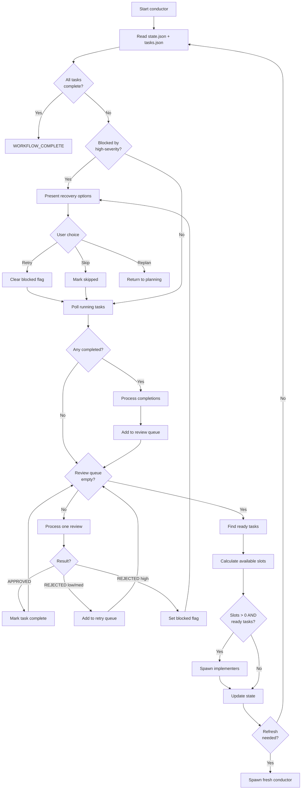
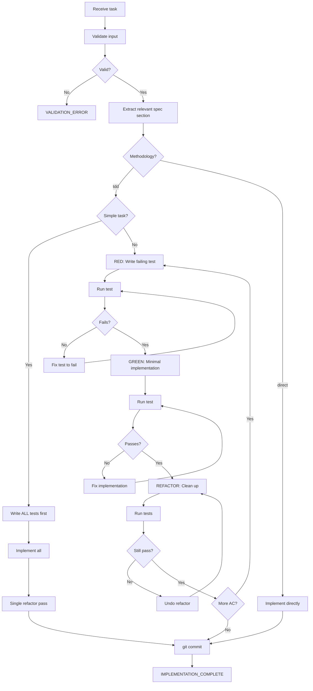
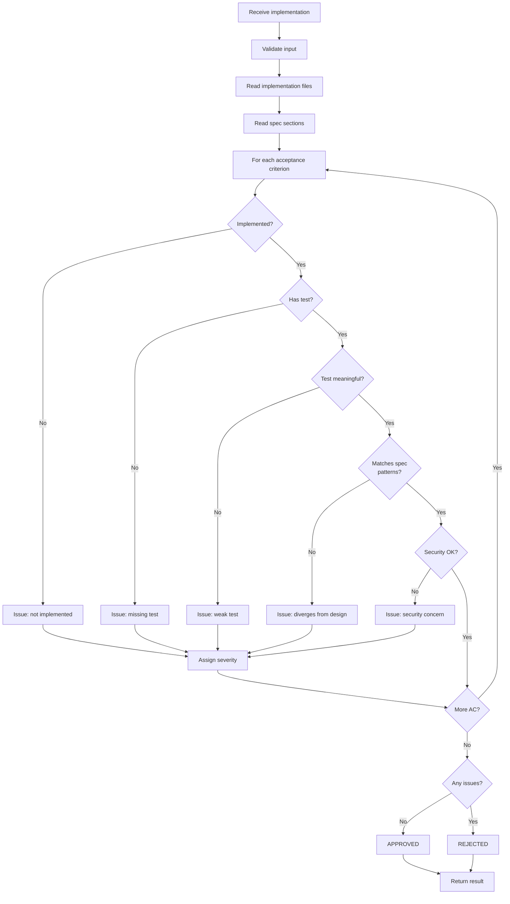

# Phase Flowcharts

## Overview: Complete Workflow

## Discovery: Dialogue Flow

## Planning: Task Decomposition

## Conductor: Main Loop

## Implementer: TDD Flow

## Reviewer: Verification Flow

