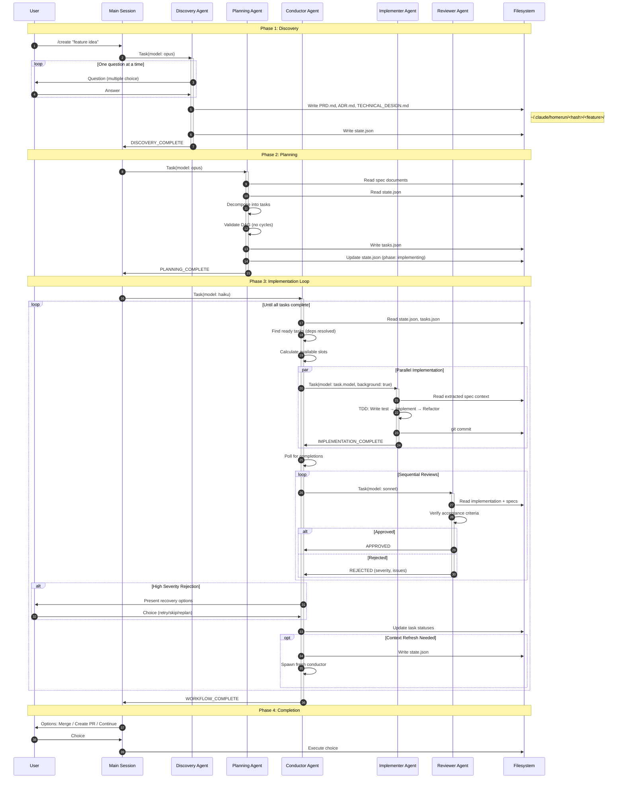
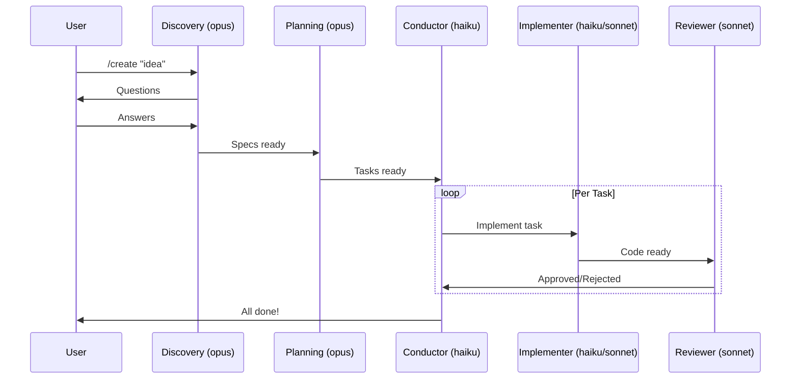
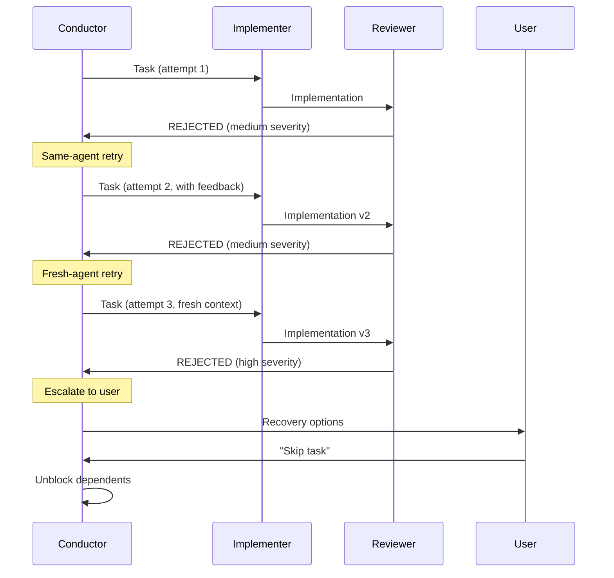
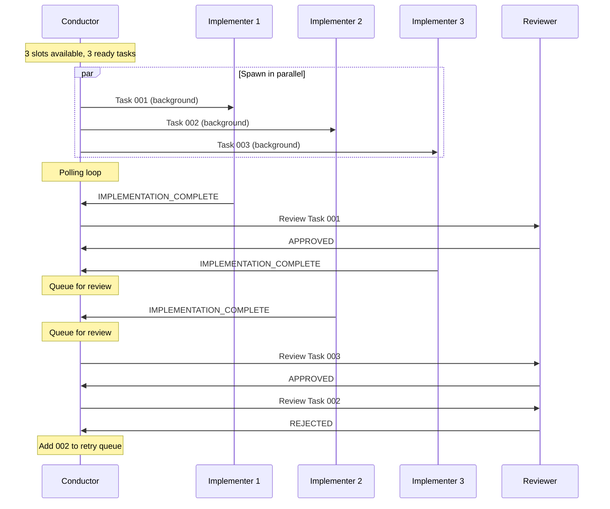

# Sequence Diagram

## Full Workflow Sequence

```mermaid
sequenceDiagram
    autonumber
    participant U as User
    participant M as Main Session
    participant D as Discovery Agent
    participant P as Planning Agent
    participant C as Conductor Agent
    participant I as Implementer Agent
    participant R as Reviewer Agent
    participant FS as Filesystem

    Note over U,FS: Phase 1: Discovery
    U->>M: /create "feature idea"
    M->>D: Task(model: opus)
    activate D

    loop One question at a time
        D->>U: Question (multiple choice)
        U->>D: Answer
    end

    D->>FS: Write PRD.md, ADR.md, TECHNICAL_DESIGN.md
    Note right of FS: ~/.claude/homerun/<hash>/<feature>/
    D->>FS: Write state.json
    D->>M: DISCOVERY_COMPLETE
    deactivate D

    Note over U,FS: Phase 2: Planning
    M->>P: Task(model: opus)
    activate P
    P->>FS: Read spec documents
    P->>FS: Read state.json
    P->>P: Decompose into tasks
    P->>P: Validate DAG (no cycles)
    P->>FS: Write tasks.json
    P->>FS: Update state.json (phase: implementing)
    P->>M: PLANNING_COMPLETE
    deactivate P

    Note over U,FS: Phase 3: Implementation Loop
    M->>C: Task(model: haiku)
    activate C

    loop Until all tasks complete
        C->>FS: Read state.json, tasks.json
        C->>C: Find ready tasks (deps resolved)
        C->>C: Calculate available slots

        par Parallel Implementation
            C->>I: Task(model: task.model, background: true)
            activate I
            I->>FS: Read extracted spec context
            I->>I: TDD: Write test → Implement → Refactor
            I->>FS: git commit
            I->>C: IMPLEMENTATION_COMPLETE
            deactivate I
        end

        C->>C: Poll for completions

        loop Sequential Reviews
            C->>R: Task(model: sonnet)
            activate R
            R->>FS: Read implementation + specs
            R->>R: Verify acceptance criteria
            alt Approved
                R->>C: APPROVED
            else Rejected
                R->>C: REJECTED (severity, issues)
            end
            deactivate R
        end

        alt High Severity Rejection
            C->>U: Present recovery options
            U->>C: Choice (retry/skip/replan)
        end

        C->>FS: Update task statuses

        opt Context Refresh Needed
            C->>FS: Write state.json
            C->>C: Spawn fresh conductor
        end
    end

    C->>M: WORKFLOW_COMPLETE
    deactivate C

    Note over U,FS: Phase 4: Completion
    M->>U: Options: Merge / Create PR / Continue
    U->>M: Choice
    M->>FS: Execute choice
```

## Simplified Flow

```mermaid
sequenceDiagram
    participant User
    participant Discovery as Discovery (opus)
    participant Planning as Planning (opus)
    participant Conductor as Conductor (haiku)
    participant Impl as Implementer (haiku/sonnet)
    participant Review as Reviewer (sonnet)

    User->>Discovery: /create "idea"
    Discovery->>User: Questions
    User->>Discovery: Answers
    Discovery->>Planning: Specs ready

    Planning->>Conductor: Tasks ready

    loop Per Task
        Conductor->>Impl: Implement task
        Impl->>Review: Code ready
        Review->>Conductor: Approved/Rejected
    end

    Conductor->>User: All done!
```

## Retry Sequence

```mermaid
sequenceDiagram
    participant C as Conductor
    participant I as Implementer
    participant R as Reviewer
    participant U as User

    C->>I: Task (attempt 1)
    I->>R: Implementation
    R->>C: REJECTED (medium severity)

    Note over C: Same-agent retry
    C->>I: Task (attempt 2, with feedback)
    I->>R: Implementation v2
    R->>C: REJECTED (medium severity)

    Note over C: Fresh-agent retry
    C->>I: Task (attempt 3, fresh context)
    I->>R: Implementation v3
    R->>C: REJECTED (high severity)

    Note over C: Escalate to user
    C->>U: Recovery options
    U->>C: "Skip task"
    C->>C: Unblock dependents
```

## Parallel Execution Sequence

```mermaid
sequenceDiagram
    participant C as Conductor
    participant I1 as Implementer 1
    participant I2 as Implementer 2
    participant I3 as Implementer 3
    participant R as Reviewer

    Note over C: 3 slots available, 3 ready tasks

    par Spawn in parallel
        C->>I1: Task 001 (background)
        C->>I2: Task 002 (background)
        C->>I3: Task 003 (background)
    end

    Note over C: Polling loop

    I1->>C: IMPLEMENTATION_COMPLETE
    C->>R: Review Task 001
    R->>C: APPROVED

    I3->>C: IMPLEMENTATION_COMPLETE
    Note over C: Queue for review

    I2->>C: IMPLEMENTATION_COMPLETE
    Note over C: Queue for review

    C->>R: Review Task 003
    R->>C: APPROVED

    C->>R: Review Task 002
    R->>C: REJECTED

    Note over C: Add 002 to retry queue
```
