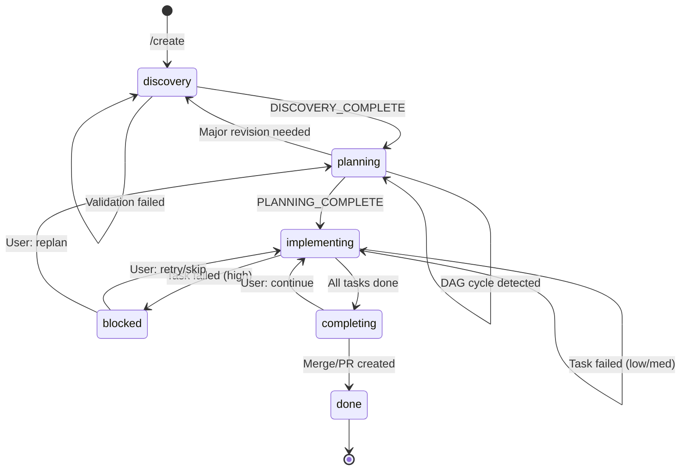
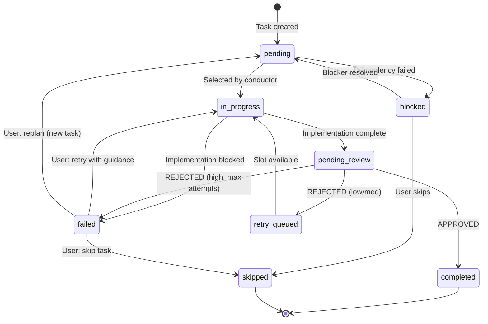
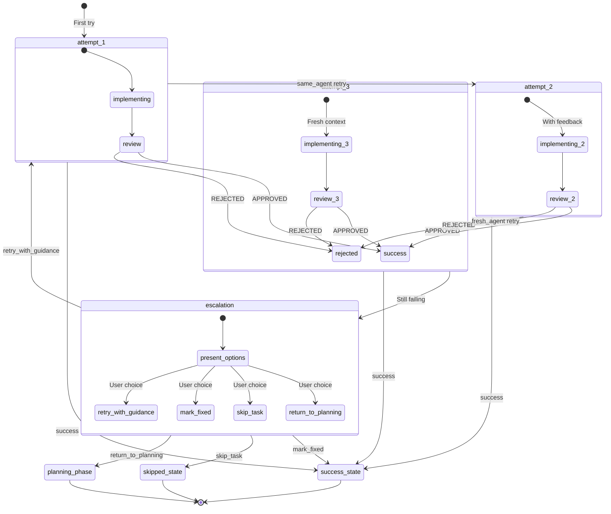
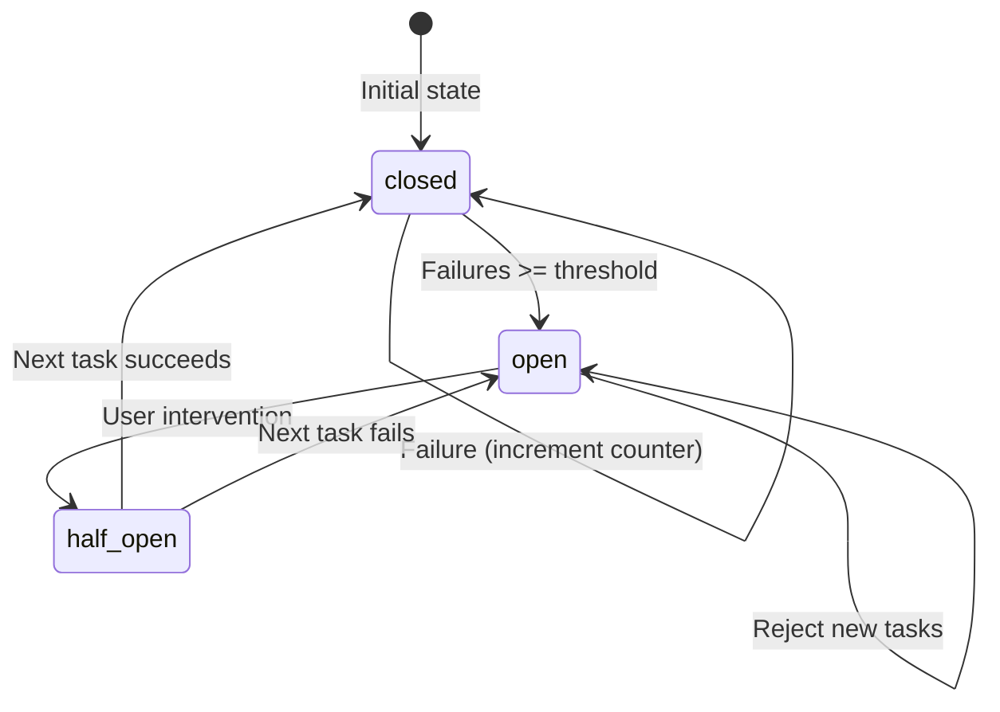
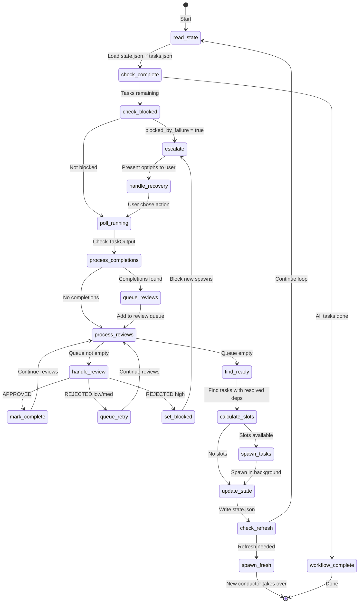
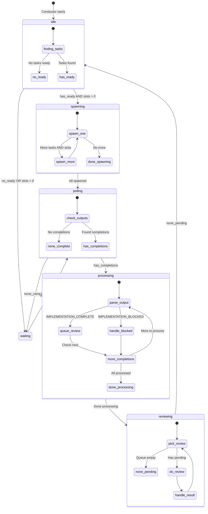
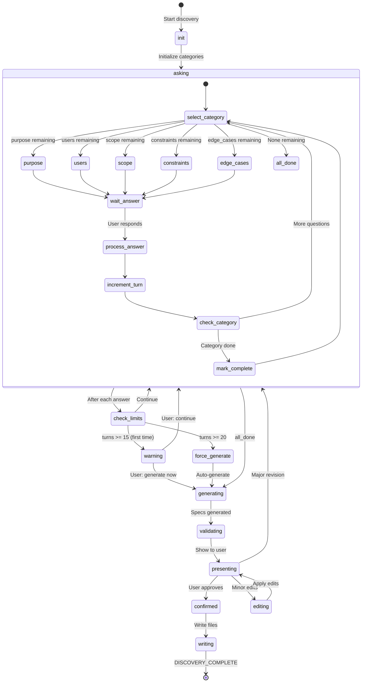

# State Machine Diagrams

## Workflow Phase State Machine

## Task Status State Machine

## Retry State Machine

## Circuit Breaker State Machine

## Conductor Loop State Machine

## Parallel Execution State Machine

## Dialogue State Machine (Discovery)

