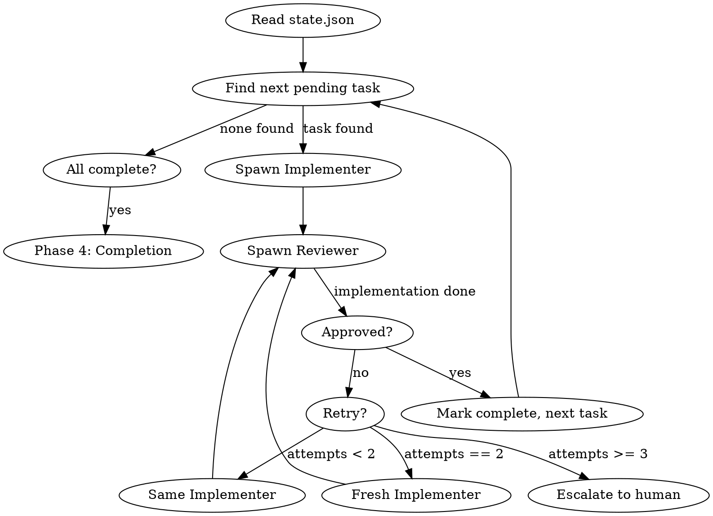

# Create Workflow Plugin Implementation Plan

> **For Claude:** REQUIRED SUB-SKILL: Use superpowers:executing-plans to implement this plan task-by-task.

**Goal:** Build the `/create` command and supporting skills to orchestrate development from idea to implementation.

**Architecture:** Plugin with 5 skills (discovery, planning, conductor, implement, review), 1 command (/create), and 5 document templates. Skills invoke each other and leverage existing superpowers skills.

**Tech Stack:** Claude Code plugin system (SKILL.md format), Markdown templates, JSON state management.

---

## Task 1: Initialize Plugin Metadata

**Files:**
- Create: `~/.claude/plugins/local/create-workflow/.claude-plugin/plugin.json`

**Step 1: Create plugin directory structure**

```bash
mkdir -p ~/.claude/plugins/local/create-workflow/.claude-plugin
```

**Step 2: Write plugin.json**

```json
{
  "name": "create-workflow",
  "description": "Orchestrated development workflow from idea to implementation with isolated agent contexts",
  "version": "0.2.0",
  "author": {
    "name": "zxela"
  },
  "license": "MIT",
  "keywords": ["workflow", "orchestration", "prd", "adr", "planning", "implementation"]
}
```

**Step 3: Verify plugin structure**

```bash
ls -la ~/.claude/plugins/local/create-workflow/.claude-plugin/
cat ~/.claude/plugins/local/create-workflow/.claude-plugin/plugin.json
```

Expected: plugin.json exists with correct content

**Step 4: Commit**

```bash
cd ~/.claude/plugins/local/create-workflow
git init
git add .claude-plugin/plugin.json
git commit -m "chore: initialize create-workflow plugin"
```

---

## Task 2: Create Document Templates

**Files:**
- Create: `templates/PRD.md`
- Create: `templates/ADR.md`
- Create: `templates/TECHNICAL_DESIGN.md`
- Create: `templates/WIREFRAMES.md`
- Create: `templates/TASK.md`

**Step 1: Create templates directory**

```bash
mkdir -p ~/.claude/plugins/local/create-workflow/templates
```

**Step 2: Write PRD template**

```markdown
# Product Requirements Document: {{FEATURE_NAME}}

## Problem Statement
<!-- What problem are we solving? Who has this problem? -->

## Goals
<!-- What does success look like? -->
-

## Non-Goals
<!-- What are we explicitly NOT doing? -->
-

## User Stories
<!-- As a [type of user], I want [goal] so that [benefit] -->

### Story 1
**As a**
**I want**
**So that**

## Success Metrics
<!-- How will we measure success? -->
-

## Open Questions
<!-- What still needs to be decided? -->
-
```

**Step 3: Write ADR template**

```markdown
# Architecture Decision Record: {{DECISION_TITLE}}

## Status
Proposed | Accepted | Deprecated | Superseded

## Context
<!-- What is the issue that we're seeing that is motivating this decision? -->

## Decision
<!-- What is the change that we're proposing and/or doing? -->

## Options Considered

### Option 1: {{OPTION_NAME}}
**Pros:**
-

**Cons:**
-

### Option 2: {{OPTION_NAME}}
**Pros:**
-

**Cons:**
-

## Consequences
<!-- What becomes easier or more difficult because of this change? -->

### Positive
-

### Negative
-

### Risks
-
```

**Step 4: Write TECHNICAL_DESIGN template**

```markdown
# Technical Design: {{FEATURE_NAME}}

## Overview
<!-- High-level description of the technical approach -->

## Architecture

### Component Diagram
```
<!-- ASCII or Mermaid diagram of components -->
```

### Data Flow
<!-- How does data move through the system? -->

## Data Models

### {{MODEL_NAME}}
| Field | Type | Description |
|-------|------|-------------|
| | | |

## API Contracts

### {{ENDPOINT_NAME}}
- **Method:** GET | POST | PUT | DELETE
- **Path:** `/api/...`
- **Request:**
```json
{}
```
- **Response:**
```json
{}
```

## Dependencies
<!-- External services, libraries, or systems -->
-

## Security Considerations
<!-- Authentication, authorization, data protection -->
-

## Testing Strategy
<!-- How will this be tested? -->
-

## Rollout Plan
<!-- How will this be deployed? -->
-
```

**Step 5: Write WIREFRAMES template**

```markdown
# Wireframes: {{FEATURE_NAME}}

## Screen Flow
```
<!-- Mermaid or ASCII diagram showing navigation -->
```

## Screens

### {{SCREEN_NAME}}

**Purpose:**

**Layout:**
```
┌─────────────────────────────────────┐
│                                     │
│                                     │
│                                     │
└─────────────────────────────────────┘
```

**Components:**
-

**Interactions:**
-

### Component Hierarchy
```
App
├── Header
├── Main
│   ├── Component1
│   └── Component2
└── Footer
```
```

**Step 6: Write TASK template**

```markdown
---
id: "{{TASK_ID}}"
title: "{{TASK_TITLE}}"
status: pending
depends_on: []
test_file: "{{TEST_FILE_PATH}}"
---

## Objective
<!-- What does this task accomplish? -->

## Acceptance Criteria
- [ ]
- [ ]
- [ ]

## Technical Notes
<!-- Reference to design docs, implementation hints -->

## Test Requirements
<!-- What test(s) verify this task? -->
```

**Step 7: Verify templates**

```bash
ls ~/.claude/plugins/local/create-workflow/templates/
```

Expected: PRD.md, ADR.md, TECHNICAL_DESIGN.md, WIREFRAMES.md, TASK.md

**Step 8: Commit**

```bash
cd ~/.claude/plugins/local/create-workflow
git add templates/
git commit -m "feat: add document templates for PRD, ADR, tech design, wireframes, and tasks"
```

---

## Task 3: Create /create Command

**Files:**
- Create: `commands/create.md`

**Step 1: Create commands directory**

```bash
mkdir -p ~/.claude/plugins/local/create-workflow/commands
```

**Step 2: Write create command**

```markdown
---
description: "Start orchestrated development workflow from idea to implementation"
---

Parse the user's input for:
- **prompt**: The description of what to build (required, first argument or quoted string)
- **--auto**: Enable fully automated mode (no confirmations between phases)
- **--resume**: Resume an interrupted session
- **--retries N,M**: Configure retry limits (default: 2,1 for same-agent, fresh-agent)

If --resume flag is present:
1. Find existing worktree with `git worktree list | grep create/`
2. Read state.json from that worktree
3. Invoke appropriate skill based on phase value

Otherwise:
1. Announce: "Starting /create workflow for: [prompt summary]"
2. Store configuration in memory: { auto_mode, retries }
3. Invoke create-workflow:discovery skill with the prompt and configuration
```

**Step 3: Verify command**

```bash
cat ~/.claude/plugins/local/create-workflow/commands/create.md
```

**Step 4: Commit**

```bash
cd ~/.claude/plugins/local/create-workflow
git add commands/
git commit -m "feat: add /create command entry point"
```

---

## Task 4: Create Discovery Skill (Phase 1)

**Files:**
- Create: `skills/discovery/SKILL.md`

**Step 1: Create skills directory**

```bash
mkdir -p ~/.claude/plugins/local/create-workflow/skills/discovery
```

**Step 2: Write discovery skill**

```markdown
---
name: discovery
description: Use when starting /create workflow to refine ideas into PRD, ADR, Technical Design, and Wireframes through structured dialogue
---

# Discovery Phase

## Overview

Guide the user from rough idea to complete specification through one-question-at-a-time dialogue, then produce formal documentation.

## Process

**1. Context Gathering**
- Read CLAUDE.md if present
- Scan project structure (package.json, src/, etc.)
- Check recent git commits for patterns

**2. Refinement Dialogue**

Ask ONE question at a time. Prefer multiple choice. Cover:

| Topic | Example Questions |
|-------|-------------------|
| Purpose | "What problem does this solve?" |
| Users | "Who will use this feature?" |
| Scope | "Which of these is in scope: A, B, C, or D?" |
| Constraints | "Any technical constraints I should know about?" |
| Edge cases | "What should happen when X fails?" |

**3. Document Generation**

After gathering requirements, create worktree and write docs:

```bash
# Generate short UUID
SESSION_ID=$(cat /proc/sys/kernel/random/uuid | cut -c1-6)
FEATURE_SLUG=$(echo "$FEATURE_NAME" | tr ' ' '-' | tr '[:upper:]' '[:lower:]')
BRANCH="create/${FEATURE_SLUG}-${SESSION_ID}"

# Create worktree
git worktree add -b "$BRANCH" "../$(basename $PWD)-${BRANCH##*/}"
```

Write to worktree:
- `docs/specs/PRD.md` - From templates/PRD.md
- `docs/specs/ADR.md` - From templates/ADR.md
- `docs/specs/TECHNICAL_DESIGN.md` - From templates/TECHNICAL_DESIGN.md
- `docs/specs/WIREFRAMES.md` - Skip if no UI, else from templates/WIREFRAMES.md

Initialize state:
```json
{
  "session_id": "<feature>-<uuid>",
  "branch": "create/<feature>-<uuid>",
  "worktree": "../<repo>-<feature>-<uuid>",
  "feature": "<feature>",
  "created_at": "<ISO timestamp>",
  "phase": "discovery",
  "tasks": {},
  "current_task": null,
  "config": {
    "auto_mode": false,
    "retries": { "same_agent": 2, "fresh_agent": 1 }
  }
}
```

**4. Validation**

Present each document section-by-section (200-300 words). Ask:
"Does this section accurately capture your intent?"

**5. Transition**

After all docs validated and committed:
- Update state.json: `"phase": "planning"`
- If auto_mode: Invoke create-workflow:planning immediately
- Else: Ask "Ready to break this into tasks?"

## Exit Criteria
- [ ] All docs written and committed
- [ ] User confirmed accuracy
- [ ] state.json created with phase: "planning"
```

**Step 3: Verify skill**

```bash
cat ~/.claude/plugins/local/create-workflow/skills/discovery/SKILL.md
```

**Step 4: Commit**

```bash
cd ~/.claude/plugins/local/create-workflow
git add skills/discovery/
git commit -m "feat: add discovery skill for Phase 1 requirements gathering"
```

---

## Task 5: Create Planning Skill (Phase 2)

**Files:**
- Create: `skills/planning/SKILL.md`

**Step 1: Create planning skill directory**

```bash
mkdir -p ~/.claude/plugins/local/create-workflow/skills/planning
```

**Step 2: Write planning skill**

```markdown
---
name: planning
description: Use when discovery phase complete to break specifications into test-bounded, commit-sized tasks
---

# Planning Phase

## Overview

Read specification docs and decompose into sequenced, test-bounded tasks. Each task = one commit with at least one verifying test.

## Input

Read from worktree (found via state.json):
- `docs/specs/PRD.md`
- `docs/specs/ADR.md`
- `docs/specs/TECHNICAL_DESIGN.md`
- `docs/specs/WIREFRAMES.md` (if exists)

## Task Decomposition Rules

Each task MUST:
1. Be completable in a single commit
2. Have at least one test that verifies it
3. Have clear acceptance criteria from specs
4. Declare dependencies on other tasks

**Task sizing guide:**
- Too big: "Implement authentication"
- Right size: "Create User model with email and password_hash fields"
- Too small: "Add email field to User"

**No-test exceptions (must be explicit):**
- Pure config changes (e.g., environment variables)
- Documentation-only tasks
- Infrastructure setup with no testable behavior

## Process

**1. Analyze Scope**

From TECHNICAL_DESIGN.md, identify:
- Data models needed
- API endpoints
- UI components (if any)
- External integrations

**2. Create Dependency Graph**

```
001-setup-models
    ↓
002-implement-core-logic ←── 003-add-api-endpoints
    ↓                            ↓
004-integrate-frontend ──────────┘
```

**3. Write Task Files**

For each task, create `docs/tasks/NNN-<slug>.md`:

```markdown
---
id: "NNN"
title: "<task title>"
status: pending
depends_on: ["<dependency-ids>"]
test_file: "<path/to/test/file>"
---

## Objective
<what this task accomplishes>

## Acceptance Criteria
- [ ] <criterion from PRD/design>
- [ ] <criterion from PRD/design>

## Technical Notes
Reference: TECHNICAL_DESIGN.md#<section>

## Test Requirements
Test file: <path>
Test verifies: <what the test checks>
```

**4. Update State**

```json
{
  "phase": "implementing",
  "tasks": {
    "001": { "status": "pending", "attempts": 0 },
    "002": { "status": "pending", "attempts": 0 }
  },
  "current_task": null
}
```

**5. Transition**

- Commit all task files
- If auto_mode: Invoke create-workflow:conductor
- Else: Ask "Ready to start implementation?"

## Output Structure

```
docs/tasks/
├── state.json
├── 001-setup-user-model.md
├── 002-add-password-hashing.md
├── 003-create-login-endpoint.md
└── ...
```

## Exit Criteria
- [ ] All tasks have test_file specified (or explicit exception)
- [ ] Dependencies form valid DAG (no cycles)
- [ ] state.json updated with all tasks
- [ ] Tasks committed to git
```

**Step 3: Verify skill**

```bash
cat ~/.claude/plugins/local/create-workflow/skills/planning/SKILL.md
```

**Step 4: Commit**

```bash
cd ~/.claude/plugins/local/create-workflow
git add skills/planning/
git commit -m "feat: add planning skill for Phase 2 task breakdown"
```

---

## Task 6: Create Conductor Skill (Phase 3 Orchestration)

**Files:**
- Create: `skills/conductor/SKILL.md`

**Step 1: Create conductor skill directory**

```bash
mkdir -p ~/.claude/plugins/local/create-workflow/skills/conductor
```

**Step 2: Write conductor skill**

```markdown
---
name: conductor
description: Use when planning phase complete to orchestrate the implementation loop - spawning implementer and reviewer agents
---

# Conductor Phase

## Overview

Orchestrate the implementation loop: read state, spawn implementer, spawn reviewer, handle retries, advance to next task.

## Loop Flow



## State Management

Before each action, read fresh state.json:

```json
{
  "phase": "implementing",
  "current_task": "002",
  "tasks": {
    "001": { "status": "completed", "attempts": 1 },
    "002": { "status": "in_progress", "attempts": 1 }
  }
}
```

## Spawning Implementer

Use Task tool with subagent:

```
Prompt:
"You are implementing task {id} for the {feature} feature.

## Your Task
{contents of task file}

## Reference Documents
- docs/specs/TECHNICAL_DESIGN.md
- docs/specs/ADR.md

## Previous Attempts (if any)
{rejection feedback from prior attempts}

## Instructions
1. Read the task and referenced docs
2. Use superpowers:test-driven-development
3. Commit: 'feat({feature}): {task title}'
4. Output: IMPLEMENTATION_COMPLETE when done"
```

## Spawning Reviewer

Use Task tool with separate subagent:

```
Prompt:
"You are reviewing task {id} for the {feature} feature.

## Task Specification
{contents of task file}

## Implementation
- Recent commit(s): {commit hashes}
- Files changed: {file list}
- Test file: {test_file from task}

## Review Checklist
1. All acceptance criteria met?
2. Test verifies the criteria?
3. Aligns with TECHNICAL_DESIGN.md?
4. Security considerations from ADR.md?

## Output
APPROVED: {summary}
  OR
REJECTED: {specific issues}"
```

## Retry Logic

| Attempts | Action |
|----------|--------|
| 0-1 | Same implementer retries with rejection feedback |
| 2 | Fresh implementer (new subagent) with all prior feedback |
| 3+ | Escalate: pause loop, update phase to "escalated", notify user |

## State Updates

After implementer completes:
```json
{ "current_task": "002", "tasks": { "002": { "status": "in_progress", "attempts": 1 }}}
```

After reviewer approves:
```json
{ "current_task": null, "tasks": { "002": { "status": "completed", "attempts": 1 }}}
```

After all tasks complete:
```json
{ "phase": "completing", "current_task": null }
```

## Transition to Phase 4

When all tasks completed:
1. Update state: `"phase": "completing"`
2. Invoke create-workflow:completion (or superpowers:finishing-a-development-branch)

## Error Recovery

| Error | Detection | Action |
|-------|-----------|--------|
| Implementer crash | No commit, still in_progress | Retry from start |
| Reviewer crash | No APPROVED/REJECTED | Re-run reviewer |
| Unknown state | Invalid phase | Log error, ask user |
```

**Step 3: Verify skill**

```bash
cat ~/.claude/plugins/local/create-workflow/skills/conductor/SKILL.md
```

**Step 4: Commit**

```bash
cd ~/.claude/plugins/local/create-workflow
git add skills/conductor/
git commit -m "feat: add conductor skill for Phase 3 implementation loop"
```

---

## Task 7: Create Implement Skill

**Files:**
- Create: `skills/implement/SKILL.md`

**Step 1: Create implement skill directory**

```bash
mkdir -p ~/.claude/plugins/local/create-workflow/skills/implement
```

**Step 2: Write implement skill**

```markdown
---
name: implement
description: Use when assigned a task by the conductor to implement it using TDD
---

# Implement Task

## Overview

You are an implementer agent. Your job: implement ONE task using TDD, commit, signal completion.

**REQUIRED SUB-SKILL:** Use superpowers:test-driven-development

## Input

You receive:
- Task file contents (objective, acceptance criteria, test requirements)
- Reference to TECHNICAL_DESIGN.md and ADR.md
- Previous rejection feedback (if retry)

## Process

**1. Understand the Task**

Read the task file completely. Identify:
- What needs to be built
- Which test file to create/modify
- Dependencies on existing code

**2. Read Reference Docs**

Scan relevant sections of:
- `docs/specs/TECHNICAL_DESIGN.md` - implementation details
- `docs/specs/ADR.md` - decisions and constraints

**3. Apply TDD**

Follow superpowers:test-driven-development exactly:

```
RED:    Write failing test for first acceptance criterion
GREEN:  Write minimal code to pass
REFACTOR: Clean up while keeping green
REPEAT: Next acceptance criterion
```

**4. Address Rejection Feedback**

If this is a retry, FIRST address the specific issues:
- Read the rejection reason carefully
- Ensure the fix addresses the EXACT issue
- Don't introduce new problems

**5. Commit**

```bash
git add <files>
git commit -m "feat(<feature>): <task title>"
```

**6. Signal Completion**

Output exactly:
```
IMPLEMENTATION_COMPLETE

Files changed:
- <file1>
- <file2>

Test file: <test_file>

Commit: <commit_hash>
```

## Red Flags - STOP

- About to write code before test → STOP, write test first
- Test passes immediately → STOP, test is wrong
- Skipping acceptance criterion → STOP, must cover all
- "I'll add tests later" → STOP, TDD violation

## Exit Criteria
- [ ] All acceptance criteria have passing tests
- [ ] Code committed with proper message
- [ ] IMPLEMENTATION_COMPLETE signal sent
```

**Step 3: Verify skill**

```bash
cat ~/.claude/plugins/local/create-workflow/skills/implement/SKILL.md
```

**Step 4: Commit**

```bash
cd ~/.claude/plugins/local/create-workflow
git add skills/implement/
git commit -m "feat: add implement skill for task execution"
```

---

## Task 8: Create Review Skill

**Files:**
- Create: `skills/review/SKILL.md`

**Step 1: Create review skill directory**

```bash
mkdir -p ~/.claude/plugins/local/create-workflow/skills/review
```

**Step 2: Write review skill**

```markdown
---
name: review
description: Use when implementation complete to verify task against specification and approve or reject
---

# Review Task

## Overview

You are a reviewer agent. Your job: verify implementation meets specification, approve or reject with specific feedback.

## Input

You receive:
- Task file (objective, acceptance criteria)
- Implementation details (commit, files changed, test file)
- Reference to TECHNICAL_DESIGN.md and ADR.md

## Review Checklist

**1. Acceptance Criteria (Required)**

For EACH criterion in the task:
- [ ] Is it implemented?
- [ ] Is there a test that verifies it?
- [ ] Does the test actually test the criterion (not just exist)?

**2. Test Quality (Required)**

- [ ] Test file exists at specified path
- [ ] Tests are meaningful (not trivial assertions)
- [ ] Tests would fail if implementation was wrong

**3. Technical Alignment (Required)**

- [ ] Implementation matches TECHNICAL_DESIGN.md approach
- [ ] Data models match specification
- [ ] API contracts match specification (if applicable)

**4. Security (If Applicable)**

- [ ] ADR.md security decisions followed
- [ ] No obvious vulnerabilities introduced
- [ ] Sensitive data handled correctly

## Output Format

### If All Checks Pass:

```
APPROVED

Summary: <brief description of what was implemented correctly>

Verified:
- <criterion 1>: PASS
- <criterion 2>: PASS
```

### If Any Check Fails:

```
REJECTED

Issues:
1. <specific issue with reference to criterion or spec>
2. <specific issue>

Required fixes:
- <what must change>
- <what must change>
```

## Review Principles

**Be Specific**
- Bad: "Tests are inadequate"
- Good: "Test for criterion 2 only checks return type, not actual behavior"

**Reference Specs**
- Bad: "This doesn't match the design"
- Good: "TECHNICAL_DESIGN.md#api-contracts specifies POST, but implementation uses PUT"

**Actionable Feedback**
- Bad: "Needs improvement"
- Good: "Add assertion that password is hashed before storage"

## Red Flags - REJECT

- Missing test for any acceptance criterion
- Test passes without implementation (test is wrong)
- Implementation diverges from TECHNICAL_DESIGN.md
- Security concern not addressed per ADR.md

## Exit Criteria
- [ ] Every acceptance criterion verified
- [ ] Clear APPROVED or REJECTED with specifics
```

**Step 3: Verify skill**

```bash
cat ~/.claude/plugins/local/create-workflow/skills/review/SKILL.md
```

**Step 4: Commit**

```bash
cd ~/.claude/plugins/local/create-workflow
git add skills/review/
git commit -m "feat: add review skill for task verification"
```

---

## Task 9: Final Verification and Documentation

**Files:**
- Verify: All plugin files
- Create: `README.md`

**Step 1: Verify complete plugin structure**

```bash
find ~/.claude/plugins/local/create-workflow -type f | head -20
```

Expected structure:
```
.claude-plugin/plugin.json
commands/create.md
skills/discovery/SKILL.md
skills/planning/SKILL.md
skills/conductor/SKILL.md
skills/implement/SKILL.md
skills/review/SKILL.md
templates/PRD.md
templates/ADR.md
templates/TECHNICAL_DESIGN.md
templates/WIREFRAMES.md
templates/TASK.md
docs/2026-01-25-create-workflow-design.md
docs/plans/2026-01-25-create-workflow-implementation.md
```

**Step 2: Write README**

```markdown
# Create Workflow Plugin

Orchestrated development workflow from idea to implementation with isolated agent contexts.

## Usage

```bash
/create "Build a user authentication system"
/create --auto "Add dark mode toggle"
/create --resume
```

## Phases

1. **Discovery** - Refine idea into PRD, ADR, Tech Design, Wireframes
2. **Planning** - Break specs into test-bounded tasks
3. **Implementation** - Execute tasks with TDD, verify with reviewer
4. **Completion** - Merge, PR, or continue development

## Configuration

- `--auto`: Skip confirmations between phases
- `--resume`: Resume interrupted session
- `--retries N,M`: Retry limits (default: 2,1)

## Skills

| Skill | Phase | Purpose |
|-------|-------|---------|
| discovery | 1 | Requirements gathering and doc generation |
| planning | 2 | Task decomposition |
| conductor | 3 | Implementation loop orchestration |
| implement | 3 | Task execution (TDD) |
| review | 3 | Task verification |

## Dependencies

- superpowers:test-driven-development
- superpowers:using-git-worktrees
- superpowers:finishing-a-development-branch
```

**Step 3: Commit README**

```bash
cd ~/.claude/plugins/local/create-workflow
git add README.md
git commit -m "docs: add README with usage instructions"
```

**Step 4: Final commit log**

```bash
git log --oneline
```

Expected: 9 commits covering all components

---

## Summary

| Task | Description | Files |
|------|-------------|-------|
| 1 | Initialize plugin | plugin.json |
| 2 | Create templates | 5 template files |
| 3 | Create /create command | commands/create.md |
| 4 | Discovery skill | skills/discovery/SKILL.md |
| 5 | Planning skill | skills/planning/SKILL.md |
| 6 | Conductor skill | skills/conductor/SKILL.md |
| 7 | Implement skill | skills/implement/SKILL.md |
| 8 | Review skill | skills/review/SKILL.md |
| 9 | Verification & README | README.md |

After completion, enable the plugin in Claude Code to test the `/create` command.
