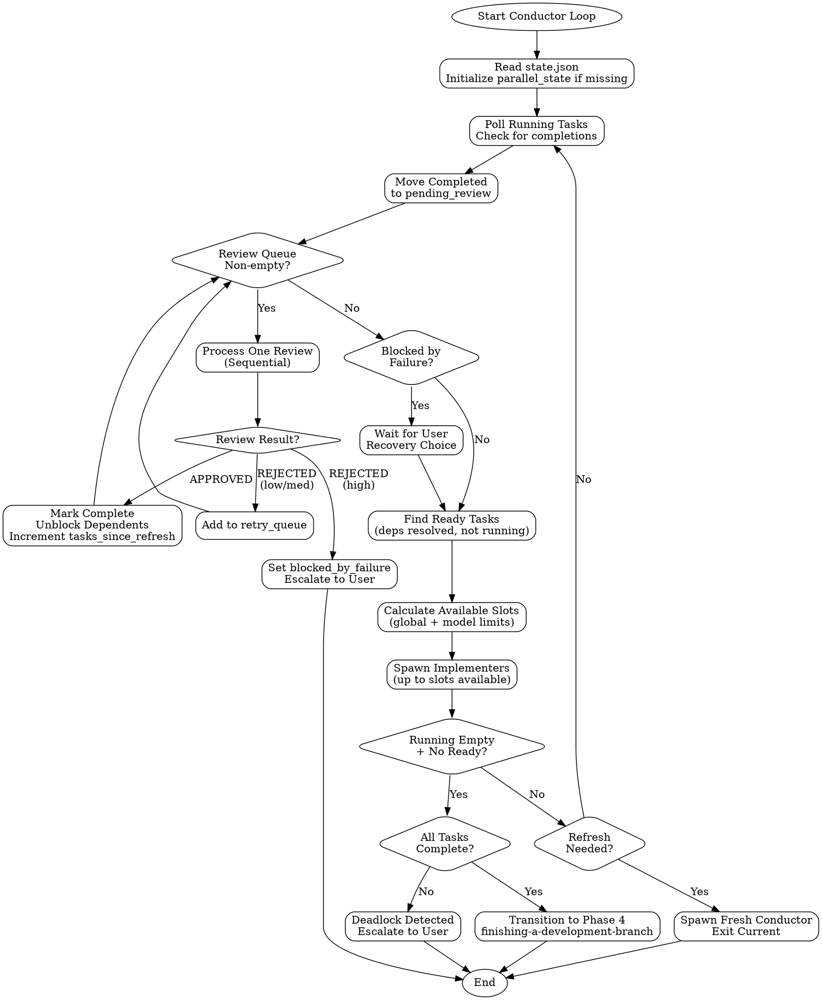

# Parallel Execution Implementation Plan

> **For Claude:** Execute this plan task-by-task, committing after each task.

**Goal:** Add parallel task execution to the homerun conductor, allowing independent tasks to run concurrently while respecting dependencies.

**Architecture:** The conductor skill is a markdown prompt that instructs Claude on orchestration behavior. We update the skill to describe reactive scheduling with parallel dispatch, sequential reviews, and severity-based failure handling.

**Tech Stack:** Markdown skill documents, JSON state schema, Task tool for agent spawning

---

## Task 1: Update State Schema Documentation

**Files:**
- Modify: `skills/conductor/SKILL.md:68-133` (State Management section)

**Step 1: Add parallel_state to Example State Structure**

Find the "Example State Structure" section and add the new parallel_state object and config options:

```json
{
  "workflow_id": "feature-auth-system",
  "phase": "implementation",
  "current_task": null,
  "spec_paths": {
    "prd": "docs/specs/PRD.md",
    "adr": "docs/specs/ADR.md",
    "technical_design": "docs/specs/TECHNICAL_DESIGN.md",
    "wireframes": "docs/specs/WIREFRAMES.md"
  },
  "tasks_file": "docs/tasks.json",
  "tasks": [...],
  "parallel_state": {
    "running_tasks": [],
    "pending_review": [],
    "retry_queue": [],
    "blocked_by_failure": false,
    "failure_severity": null,
    "tasks_since_refresh": 0
  },
  "config": {
    "timeout_minutes": 30,
    "max_identical_rejections": 3,
    "max_iterations_without_progress": 3,
    "max_total_attempts": 5,
    "max_parallel_tasks": 3,
    "max_parallel_by_model": {
      "haiku": 5,
      "sonnet": 3,
      "opus": 1
    },
    "conductor_refresh_interval": 5,
    "conductor_model": "haiku"
  }
}
```

**Step 2: Add Key State Fields for parallel_state**

Add to the "Key State Fields" table:

| Field | Purpose |
|-------|---------|
| `parallel_state.running_tasks` | Task IDs currently being implemented |
| `parallel_state.pending_review` | Completed implementations awaiting review |
| `parallel_state.retry_queue` | Failed tasks awaiting retry |
| `parallel_state.blocked_by_failure` | Whether high-severity failure paused execution |
| `parallel_state.tasks_since_refresh` | Counter for conductor refresh |
| `config.max_parallel_tasks` | Global concurrency limit |
| `config.max_parallel_by_model` | Per-model concurrency limits |
| `config.conductor_refresh_interval` | Tasks between conductor refresh |
| `config.conductor_model` | Model for conductor (default: haiku) |

**Step 3: Commit**

```bash
git add skills/conductor/SKILL.md
git commit -m "feat(conductor): add parallel_state schema documentation"
```

---

## Task 2: Replace Sequential Loop with Reactive Scheduler

**Files:**
- Modify: `skills/conductor/SKILL.md:21-66` (Loop Flow section)

**Step 1: Replace the Loop Flow diagram**

Replace the existing `digraph conductor_loop` with the new reactive scheduler:



**Step 2: Update the Overview text**

Replace the numbered list with parallel-aware description:

```markdown
The conductor orchestrates Phase 3 (Implementation) of the workflow using a **reactive scheduler**. Its responsibilities:

1. **Poll running tasks** - Check which implementer agents have completed
2. **Process reviews sequentially** - Review completed implementations one at a time
3. **Handle failures by severity** - Low/medium → retry queue, High → block and escalate
4. **Find ready tasks** - Identify tasks with resolved dependencies
5. **Spawn implementers in parallel** - Launch multiple agents within concurrency limits
6. **Manage context** - Refresh conductor after N completed tasks
7. **Transition to Phase 4** - When all tasks complete or deadlock detected

The conductor uses **haiku** by default (configurable) since scheduling is mechanical work.
```

**Step 3: Commit**

```bash
git add skills/conductor/SKILL.md
git commit -m "feat(conductor): replace sequential loop with reactive scheduler"
```

---

## Task 3: Add Ready Task Detection with Subtask Support

**Files:**
- Modify: `skills/conductor/SKILL.md` (add new section after State Management)

**Step 1: Add "Finding Ready Tasks" section**

Insert after the State Management section:

```markdown
---

## Finding Ready Tasks

The conductor identifies tasks that are ready to execute using dependency resolution.

### Ready Task Criteria

A task is **ready** if:
1. Status is `pending` (not already running or complete)
2. All `blocked_by` dependencies are `completed`
3. Not already in `running_tasks`

### Subtask Handling

When a task has subtasks:
1. **Parent never executes directly** - Only subtasks run
2. **Subtask deps resolve locally first** - Check sibling subtasks before parent-level
3. **Subtasks inherit parent's model** - For concurrency limit calculation
4. **Parent auto-completes** - When all subtasks complete

### findReadyTasks Algorithm

```javascript
function findReadyTasks(state) {
  const ready = [];
  const running = new Set(state.parallel_state.running_tasks);

  for (const task of state.tasks) {
    // Skip non-actionable tasks
    if (!['pending', 'in_progress'].includes(task.status)) continue;
    if (running.has(task.id)) continue;

    // Check parent-level dependencies
    const parentDepsResolved = (task.blocked_by || []).every(depId =>
      isTaskComplete(state, depId)
    );
    if (!parentDepsResolved) continue;

    if (task.subtasks?.length > 0) {
      // Process subtasks
      for (const subtask of task.subtasks) {
        if (subtask.status !== 'pending') continue;
        if (running.has(subtask.id)) continue;

        const subtaskDepsResolved = (subtask.blocked_by || []).every(depId => {
          // Check siblings first
          const sibling = task.subtasks.find(s => s.id === depId);
          if (sibling) return sibling.status === 'completed';
          // Then parent-level
          return isTaskComplete(state, depId);
        });

        if (subtaskDepsResolved) {
          ready.push({
            ...subtask,
            parent_id: task.id,
            model: subtask.model || task.model || 'sonnet'
          });
        }
      }
    } else if (task.status === 'pending') {
      // No subtasks - task is directly executable
      ready.push(task);
    }
  }

  return ready;
}

function isTaskComplete(state, taskId) {
  // Check top-level tasks
  const task = state.tasks.find(t => t.id === taskId);
  if (task) return task.status === 'completed';

  // Check subtasks
  for (const parent of state.tasks) {
    const subtask = parent.subtasks?.find(s => s.id === taskId);
    if (subtask) return subtask.status === 'completed';
  }

  return false;
}
```

### Example: Dependency Resolution

```
Task 001: Create User model (no deps)
  ├── 001a: Create class (no deps)         → READY
  ├── 001b: Add validation (needs 001a)    → blocked
  └── 001c: Add serialization (needs 001a) → blocked

Task 002: Create Auth service (needs 001)  → blocked (parent incomplete)
```

After 001a completes:
```
  ├── 001a: completed
  ├── 001b: Add validation (needs 001a)    → READY
  └── 001c: Add serialization (needs 001a) → READY  (parallel!)
```
```

**Step 2: Commit**

```bash
git add skills/conductor/SKILL.md
git commit -m "feat(conductor): add ready task detection with subtask support"
```

---

## Task 4: Add Slot Calculation with Model Limits

**Files:**
- Modify: `skills/conductor/SKILL.md` (add after Finding Ready Tasks)

**Step 1: Add "Concurrency Control" section**

```markdown
---

## Concurrency Control

The conductor limits parallel execution using global and model-based limits.

### Slot Calculation

```javascript
function calculateAvailableSlots(state, readyTasks) {
  const config = state.config;
  const running = state.parallel_state.running_tasks;

  // Global limit
  const globalLimit = config.max_parallel_tasks || 3;
  let availableSlots = globalLimit - running.length;

  if (availableSlots <= 0) return 0;

  // Count running tasks by model
  const runningByModel = {};
  for (const taskId of running) {
    const task = findTask(state, taskId);
    const model = task?.model || 'sonnet';
    runningByModel[model] = (runningByModel[model] || 0) + 1;
  }

  // Check model limits for ready tasks
  const modelLimits = config.max_parallel_by_model || {
    haiku: 5,
    sonnet: 3,
    opus: 1
  };

  // Find the most constrained model among ready tasks
  for (const task of readyTasks) {
    const model = task.model || 'sonnet';
    const modelLimit = modelLimits[model] || globalLimit;
    const modelRunning = runningByModel[model] || 0;
    const modelSlots = modelLimit - modelRunning;
    availableSlots = Math.min(availableSlots, modelSlots);
  }

  return Math.max(0, availableSlots);
}
```

### Model Allocation Strategy

| Role | Default Model | Rationale |
|------|---------------|-----------|
| Conductor | haiku | Scheduling is mechanical, low-cost |
| Implementer (simple) | haiku | add_field, add_method, refactor |
| Implementer (complex) | sonnet | create_model, bug_fix, architecture |
| Reviewer | sonnet | Quality judgment requires stronger model |

### Example: Slot Calculation

Config:
- `max_parallel_tasks: 3`
- `max_parallel_by_model: { haiku: 5, sonnet: 3, opus: 1 }`

State:
- Running: 1 haiku task, 1 sonnet task
- Ready: 2 haiku tasks, 1 sonnet task

Calculation:
- Global: 3 - 2 = 1 slot
- Haiku: 5 - 1 = 4 slots → min(1, 4) = 1
- Sonnet: 3 - 1 = 2 slots → min(1, 2) = 1

Result: 1 slot available (global limit is the constraint)
```

**Step 2: Commit**

```bash
git add skills/conductor/SKILL.md
git commit -m "feat(conductor): add concurrency control with model limits"
```

---

## Task 5: Add Parallel Spawning Logic

**Files:**
- Modify: `skills/conductor/SKILL.md:443-556` (Spawning Implementer section)

**Step 1: Update spawning to support parallel dispatch**

Add new section "Parallel Task Spawning":

```markdown
---

## Parallel Task Spawning

Spawn multiple implementers in parallel using the Task tool with `run_in_background: true`.

### Spawning Multiple Tasks

```javascript
function spawnReadyTasks(state, readyTasks, slots) {
  const tasksToSpawn = readyTasks.slice(0, slots);

  for (const task of tasksToSpawn) {
    // Build input
    const input = buildImplementerInput(state, task);

    // Log invocation
    logSkillInvocation(state, "homerun:implement", task.id);

    // Mark as running
    state.parallel_state.running_tasks.push(task.id);
    updateTaskStatus(state, task.id, 'in_progress');

    // Spawn in background
    Task({
      description: `Implement: ${task.title}`,
      subagent_type: "general-purpose",
      model: task.model || "sonnet",
      run_in_background: true,
      prompt: `Use the homerun:implement skill.

Input:
\`\`\`json
${JSON.stringify(input, null, 2)}
\`\`\`
`
    });
  }

  return tasksToSpawn.length;
}
```

### Polling for Completion

After spawning, poll for completed tasks:

```javascript
function pollCompletedTasks(state) {
  const completed = [];

  for (const taskId of state.parallel_state.running_tasks) {
    // Check if task output file exists and is complete
    // The Task tool creates output files for background tasks
    const output = checkTaskOutput(taskId);

    if (output && output.complete) {
      completed.push({
        id: taskId,
        output: output.result
      });
    }
  }

  return completed;
}
```

### Processing Completions

```javascript
function processCompletions(state, completedTasks) {
  for (const { id, output } of completedTasks) {
    // Remove from running
    state.parallel_state.running_tasks =
      state.parallel_state.running_tasks.filter(t => t !== id);

    // Parse output
    try {
      const result = parseImplementerOutput(output);

      if (result.signal === "IMPLEMENTATION_COMPLETE") {
        // Queue for review
        state.parallel_state.pending_review.push({
          task_id: id,
          implementation: result
        });
      } else if (result.signal === "IMPLEMENTATION_BLOCKED") {
        // Handle blocked task
        handleBlockedTask(state, id, result);
      }
    } catch (error) {
      // Parse error - add to retry queue
      addToRetryQueue(state, id, { error: error.message });
    }
  }
}
```
```

**Step 2: Commit**

```bash
git add skills/conductor/SKILL.md
git commit -m "feat(conductor): add parallel spawning with background tasks"
```

---

## Task 6: Add Sequential Review Processing

**Files:**
- Modify: `skills/conductor/SKILL.md` (update Spawning Reviewer section)

**Step 1: Add "Sequential Review Queue" section**

```markdown
---

## Sequential Review Queue

Reviews are processed one at a time to avoid cascading issues.

### Processing Reviews

```javascript
function processReviewQueue(state) {
  // Process one review at a time
  if (state.parallel_state.pending_review.length === 0) {
    return { action: 'continue' };
  }

  const review = state.parallel_state.pending_review.shift();
  const task = findTask(state, review.task_id);

  // Build reviewer input
  const reviewerInput = buildReviewerInput(state, task, review.implementation);

  // Log invocation
  logSkillInvocation(state, "homerun:review", review.task_id);

  // Spawn reviewer (blocking - wait for result)
  const result = Task({
    description: `Review: ${task.title}`,
    subagent_type: "general-purpose",
    model: "sonnet",  // Always sonnet for reviews
    prompt: `Use the homerun:review skill.

Input:
\`\`\`json
${JSON.stringify(reviewerInput, null, 2)}
\`\`\`
`
  });

  return handleReviewResult(state, task, result);
}
```

### Handling Review Results

```javascript
function handleReviewResult(state, task, result) {
  const reviewResult = parseReviewerOutput(result);

  if (reviewResult.signal === "APPROVED") {
    // Mark complete
    markTaskComplete(state, task.id);
    unblockDependents(state, task.id);

    // Increment refresh counter
    state.parallel_state.tasks_since_refresh++;

    return { action: 'continue' };
  }

  if (reviewResult.signal === "REJECTED") {
    // Check severity
    const severity = reviewResult.severity || 'medium';

    if (severity === 'high') {
      // Block execution
      state.parallel_state.blocked_by_failure = true;
      state.parallel_state.failure_severity = 'high';

      return {
        action: 'blocked',
        task_id: task.id,
        feedback: reviewResult
      };
    }

    // Low/medium - add to retry queue
    addToRetryQueue(state, task.id, reviewResult);
    return { action: 'continue' };
  }
}
```

### Marking Tasks Complete with Subtask Rollup

```javascript
function markTaskComplete(state, taskId) {
  // Find task (top-level or subtask)
  for (const task of state.tasks) {
    if (task.id === taskId) {
      task.status = 'completed';
      task.completed_at = new Date().toISOString();
      return;
    }

    // Check subtasks
    const subtask = task.subtasks?.find(s => s.id === taskId);
    if (subtask) {
      subtask.status = 'completed';
      subtask.completed_at = new Date().toISOString();

      // Check if all subtasks complete → parent completes
      if (task.subtasks.every(s => s.status === 'completed')) {
        task.status = 'completed';
        task.completed_at = new Date().toISOString();
      }
      return;
    }
  }
}
```
```

**Step 2: Commit**

```bash
git add skills/conductor/SKILL.md
git commit -m "feat(conductor): add sequential review processing with subtask rollup"
```

---

## Task 7: Add Severity-Based Failure Handling

**Files:**
- Modify: `skills/conductor/SKILL.md` (add after Review Queue section)

**Step 1: Add "Failure Handling" section**

```markdown
---

## Severity-Based Failure Handling

The conductor responds differently based on rejection severity.

### Severity Levels

| Severity | Response | Rationale |
|----------|----------|-----------|
| Low | Add to retry queue, continue | Minor issues, other tasks unaffected |
| Medium | Add to retry queue, continue | Moderate issues, isolated to task |
| High | Block new spawns, escalate | May affect other tasks, needs human judgment |

### Retry Queue Management

```javascript
function addToRetryQueue(state, taskId, feedback) {
  const task = findTask(state, taskId);

  state.parallel_state.retry_queue.push({
    task_id: taskId,
    attempts: (task.attempts || 0) + 1,
    feedback: feedback,
    added_at: new Date().toISOString()
  });

  // Update task status
  task.status = 'pending';  // Reset for retry
  task.feedback = task.feedback || [];
  task.feedback.push(feedback);
}

function processRetryQueue(state) {
  // Process retries after fresh tasks (lower priority)
  if (state.parallel_state.retry_queue.length === 0) return [];

  const readyRetries = [];

  for (const retry of state.parallel_state.retry_queue) {
    const task = findTask(state, retry.task_id);

    // Check retry limits
    if (retry.attempts >= state.config.max_total_attempts) {
      // Escalate permanently
      task.status = 'escalated';
      continue;
    }

    // Check if deps still resolved
    if (areDependenciesResolved(state, task)) {
      readyRetries.push({
        ...task,
        previous_feedback: retry.feedback,
        is_retry: true,
        attempt_number: retry.attempts
      });
    }
  }

  return readyRetries;
}
```

### High-Severity Escalation with TUI

When blocked by high-severity failure, present recovery options:

```javascript
function handleHighSeverityFailure(state, taskId, feedback) {
  // Use AskUserQuestion for structured recovery
  AskUserQuestion({
    questions: [{
      question: `Task ${taskId} failed with high severity: "${feedback.summary}". How would you like to proceed?`,
      header: "Recovery",
      options: [
        {
          label: "Retry with guidance",
          description: "Provide additional context and retry implementation"
        },
        {
          label: "Mark as fixed",
          description: "I manually fixed the issue, continue from here"
        },
        {
          label: "Skip task",
          description: "Skip this task and unblock dependents"
        },
        {
          label: "Return to planning",
          description: "Restructure tasks to address the issue"
        }
      ],
      multiSelect: false
    }]
  });
}
```

### Recovery Actions

```javascript
function handleRecoveryChoice(state, taskId, choice) {
  const task = findTask(state, taskId);

  switch (choice) {
    case "Retry with guidance":
      // Prompt for guidance, add to retry queue with context
      state.parallel_state.blocked_by_failure = false;
      addToRetryQueue(state, taskId, { guidance_requested: true });
      break;

    case "Mark as fixed":
      markTaskComplete(state, taskId);
      unblockDependents(state, taskId);
      state.parallel_state.blocked_by_failure = false;
      break;

    case "Skip task":
      task.status = 'skipped';
      unblockDependents(state, taskId);
      state.parallel_state.blocked_by_failure = false;
      break;

    case "Return to planning":
      state.phase = 'planning';
      state.parallel_state.blocked_by_failure = false;
      break;
  }
}
```
```

**Step 2: Commit**

```bash
git add skills/conductor/SKILL.md
git commit -m "feat(conductor): add severity-based failure handling with TUI recovery"
```

---

## Task 8: Add Conductor Refresh Logic

**Files:**
- Modify: `skills/conductor/SKILL.md` (add before Phase 4 transition)

**Step 1: Add "Conductor Context Management" section**

```markdown
---

## Conductor Context Management

The conductor refreshes itself to prevent token accumulation.

### Refresh Trigger

After completing `conductor_refresh_interval` tasks (default: 5), spawn a fresh conductor:

```javascript
function checkConductorRefresh(state) {
  const interval = state.config.conductor_refresh_interval || 5;

  if (state.parallel_state.tasks_since_refresh >= interval) {
    return true;
  }
  return false;
}

function spawnFreshConductor(state) {
  // Reset counter before saving
  state.parallel_state.tasks_since_refresh = 0;
  saveState(state);

  // Spawn fresh conductor with configured model
  Task({
    description: "Continue conductor loop",
    subagent_type: "general-purpose",
    model: state.config.conductor_model || "haiku",
    prompt: `Use the homerun:conductor skill.

Worktree: ${state.worktree}

Continue the implementation loop. A fresh conductor is starting with clean context.
Read state.json to resume from current progress.`
  });

  // Current conductor exits
  return { action: 'refresh_exit' };
}
```

### Context Hygiene Practices

To minimize token usage:

1. **Store IDs, not content** - Keep task IDs in parallel_state, read full task from state.json when needed
2. **Parse immediately** - Extract signals from agent output, discard raw text
3. **Write to state** - Persist all important data to state.json, not in-memory
4. **Fresh agents** - Each implementer/reviewer starts with clean context
```

**Step 2: Commit**

```bash
git add skills/conductor/SKILL.md
git commit -m "feat(conductor): add conductor refresh for context management"
```

---

## Task 9: Update Main Conductor Loop

**Files:**
- Modify: `skills/conductor/SKILL.md:1297-1335` (Error Handling Implementation section)

**Step 1: Replace conductorLoop with parallel version**

Replace the existing `conductorLoop` implementation:

```javascript
async function conductorLoop(state) {
  // Initialize parallel_state if missing
  state.parallel_state = state.parallel_state || {
    running_tasks: [],
    pending_review: [],
    retry_queue: [],
    blocked_by_failure: false,
    failure_severity: null,
    tasks_since_refresh: 0
  };

  while (true) {
    // 1. Poll for completed tasks
    const completed = pollCompletedTasks(state);
    processCompletions(state, completed);

    // 2. Process review queue (sequential)
    while (state.parallel_state.pending_review.length > 0) {
      const result = processReviewQueue(state);

      if (result.action === 'blocked') {
        await handleHighSeverityFailure(state, result.task_id, result.feedback);
        await saveState(state);
        return; // Exit, wait for user recovery
      }
    }

    // 3. Check if blocked by failure
    if (state.parallel_state.blocked_by_failure) {
      // Wait for user input via TUI
      continue;
    }

    // 4. Find ready tasks (fresh + retries)
    const freshReady = findReadyTasks(state);
    const retryReady = processRetryQueue(state);
    const allReady = [...freshReady, ...retryReady];

    // 5. Calculate slots and spawn
    const slots = calculateAvailableSlots(state, allReady);
    if (slots > 0 && allReady.length > 0) {
      spawnReadyTasks(state, allReady, slots);
    }

    // 6. Check for completion or deadlock
    if (state.parallel_state.running_tasks.length === 0 &&
        allReady.length === 0 &&
        state.parallel_state.pending_review.length === 0) {

      if (allTasksComplete(state)) {
        await transitionToPhase4(state);
        return;
      } else {
        await handleDeadlock(state);
        return;
      }
    }

    // 7. Check conductor refresh
    if (checkConductorRefresh(state)) {
      spawnFreshConductor(state);
      return; // This conductor exits
    }

    // 8. Save state and continue loop
    await saveState(state);
  }
}
```

**Step 2: Commit**

```bash
git add skills/conductor/SKILL.md
git commit -m "feat(conductor): update main loop with parallel execution"
```

---

## Task 10: Update Planning Skill to Spawn Conductor with Haiku

**Files:**
- Modify: `skills/planning/SKILL.md:760-775` (Spawn Conductor section)

**Step 1: Add model parameter to conductor spawn**

Find the Task invocation for conductor and add `model: "haiku"`:

```javascript
Task({
  description: "Execute implementation loop",
  subagent_type: "general-purpose",
  model: "haiku",  // Conductor uses haiku - scheduling is mechanical
  prompt: `Use the homerun:conductor skill.

Worktree: ${state.worktree}

Begin the implementation loop. Read state.json to understand current progress.`
});
```

**Step 2: Commit**

```bash
git add skills/planning/SKILL.md
git commit -m "feat(planning): spawn conductor with haiku model"
```

---

## Task 11: Update CLAUDE.md with Parallel Execution Notes

**Files:**
- Modify: `CLAUDE.md` (Architecture section)

**Step 1: Add parallel execution to Architecture section**

Add under "### Retry Logic":

```markdown
### Parallel Execution

The conductor supports parallel task execution:
- **Independent tasks** run in parallel (up to `max_parallel_tasks`)
- **Subtasks** within a parent run in parallel when deps resolve
- **Reviews** are sequential to avoid cascade issues
- **Model limits** prevent overloading expensive models (haiku: 5, sonnet: 3, opus: 1)
- **Conductor refresh** every N tasks prevents context bloat

### Failure Handling

| Severity | Response |
|----------|----------|
| Low/Medium | Add to retry queue, continue other tasks |
| High | Block execution, present TUI recovery options |
```

**Step 2: Update Model Routing table**

Add conductor to the model routing table:

```markdown
| Role | Model | Notes |
|------|-------|-------|
| Conductor | haiku | Scheduling is mechanical |
| Implementer (simple) | haiku | add_field, add_method tasks |
| Implementer (complex) | sonnet | create_model, bug_fix tasks |
| Reviewer | sonnet | Always sonnet for quality |
```

**Step 3: Commit**

```bash
git add CLAUDE.md
git commit -m "docs: update CLAUDE.md with parallel execution architecture"
```

---

## Task 12: Final Verification

**Step 1: Review all changes**

```bash
git log --oneline -12
git diff HEAD~12 --stat
```

**Step 2: Verify skill structure**

```bash
# Check conductor skill has all new sections
grep -E "^## " skills/conductor/SKILL.md
```

Expected sections:
- Overview
- Loop Flow
- State Management
- Finding Ready Tasks
- Concurrency Control
- Parallel Task Spawning
- Sequential Review Queue
- Severity-Based Failure Handling
- Conductor Context Management
- (existing sections...)

**Step 3: Commit summary**

The implementation adds:
1. Parallel state tracking in state.json
2. Reactive scheduler replacing sequential loop
3. Ready task detection with subtask support
4. Model-based concurrency limits
5. Background task spawning
6. Sequential review processing
7. Severity-based failure handling with TUI
8. Conductor refresh for context management
9. Haiku model for conductor

---

## Summary

| Task | Description | Files |
|------|-------------|-------|
| 1 | State schema documentation | conductor/SKILL.md |
| 2 | Reactive scheduler diagram | conductor/SKILL.md |
| 3 | Ready task detection | conductor/SKILL.md |
| 4 | Slot calculation | conductor/SKILL.md |
| 5 | Parallel spawning | conductor/SKILL.md |
| 6 | Sequential reviews | conductor/SKILL.md |
| 7 | Failure handling | conductor/SKILL.md |
| 8 | Conductor refresh | conductor/SKILL.md |
| 9 | Main loop update | conductor/SKILL.md |
| 10 | Planning spawn update | planning/SKILL.md |
| 11 | CLAUDE.md docs | CLAUDE.md |
| 12 | Verification | - |
