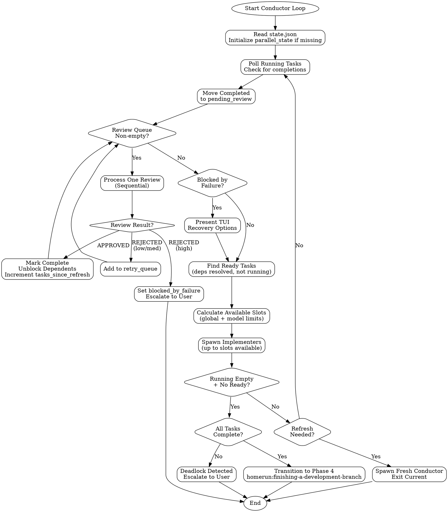

# Conductor State Machine Reference

This document contains detailed algorithms and implementation patterns for the conductor.
The conductor SKILL.md references this for implementation details.

## Reactive Scheduler Loop



---

## Finding Ready Tasks Algorithm

### Ready Task Criteria

A task is **ready** if:
1. Status is `pending` (not already running or complete)
2. All `blocked_by` dependencies have status `completed`
3. Not already in `parallel_state.running_tasks`

### Subtask Handling

When a task has subtasks:
1. **Parent never executes directly** - Only subtasks run
2. **Subtask deps resolve locally first** - Check sibling subtasks before parent-level deps
3. **Subtasks inherit parent's model** - For concurrency limit calculation
4. **Parent auto-completes** - When all subtasks reach `completed` status

### findReadyTasks Pseudocode

```javascript
function findReadyTasks(state) {
  const ready = [];
  const running = new Set(state.parallel_state.running_tasks);

  for (const task of state.tasks) {
    // Skip non-actionable tasks
    if (!['pending', 'in_progress'].includes(task.status)) continue;
    if (running.has(task.id)) continue;

    // Check parent-level dependencies
    const parentDepsResolved = (task.blocked_by || []).every(depId =>
      isTaskComplete(state, depId)
    );
    if (!parentDepsResolved) continue;

    if (task.subtasks?.length > 0) {
      // Process subtasks - parent doesn't run directly
      for (const subtask of task.subtasks) {
        if (subtask.status !== 'pending') continue;
        if (running.has(subtask.id)) continue;

        const subtaskDepsResolved = (subtask.blocked_by || []).every(depId => {
          // Check siblings first
          const sibling = task.subtasks.find(s => s.id === depId);
          if (sibling) return sibling.status === 'completed';
          // Then parent-level deps
          return isTaskComplete(state, depId);
        });

        if (subtaskDepsResolved) {
          ready.push({
            ...subtask,
            parent_id: task.id,
            model: subtask.model || task.model || 'sonnet'
          });
        }
      }
    } else if (task.status === 'pending') {
      // No subtasks - task is directly executable
      ready.push(task);
    }
  }

  return ready;
}

function isTaskComplete(state, taskId) {
  // Check top-level tasks
  const task = state.tasks.find(t => t.id === taskId);
  if (task) return task.status === 'completed';

  // Check subtasks
  for (const parent of state.tasks) {
    const subtask = parent.subtasks?.find(s => s.id === taskId);
    if (subtask) return subtask.status === 'completed';
  }

  return false;
}
```

### Dependency Resolution Example

Initial state:
```
Task 001: Create User model (no deps)
  |-- 001a: Create class (no deps)         -> READY
  |-- 001b: Add validation (needs 001a)    -> blocked
  +-- 001c: Add serialization (needs 001a) -> blocked

Task 002: Create Auth service (needs 001)  -> blocked (parent incomplete)
```

After 001a completes:
```
  |-- 001a: completed
  |-- 001b: Add validation (needs 001a)    -> READY
  +-- 001c: Add serialization (needs 001a) -> READY  (parallel with 001b!)
```

After 001b and 001c complete:
```
Task 001: completed (all subtasks done)
Task 002: Create Auth service (needs 001)  -> READY
```

---

## Concurrency Control

The conductor limits parallel execution using global and model-based limits.

### Slot Calculation Algorithm

```javascript
function calculateAvailableSlots(state, readyTasks) {
  const config = state.config;
  const running = state.parallel_state.running_tasks;

  // Global limit
  const globalLimit = config.max_parallel_tasks || 3;
  let availableSlots = globalLimit - running.length;

  if (availableSlots <= 0) return 0;

  // Count running tasks by model
  const runningByModel = {};
  for (const taskId of running) {
    const task = findTask(state, taskId);
    const model = task?.model || 'sonnet';
    runningByModel[model] = (runningByModel[model] || 0) + 1;
  }

  // Check model limits for ready tasks
  const modelLimits = config.max_parallel_by_model || {
    haiku: 5,
    sonnet: 3,
    opus: 1
  };

  // Find the most constrained model among ready tasks
  for (const task of readyTasks) {
    const model = task.model || 'sonnet';
    const modelLimit = modelLimits[model] || globalLimit;
    const modelRunning = runningByModel[model] || 0;
    const modelSlots = modelLimit - modelRunning;
    availableSlots = Math.min(availableSlots, modelSlots);
  }

  return Math.max(0, availableSlots);
}
```

### Slot Calculation Example

Config:
- `max_parallel_tasks: 3`
- `max_parallel_by_model: { haiku: 5, sonnet: 3, opus: 1 }`

Current state:
- Running: 1 haiku task, 1 sonnet task (2 total)
- Ready: 2 haiku tasks, 1 sonnet task

Calculation:
```
Global: 3 - 2 = 1 slot available
Haiku: 5 - 1 = 4 slots -> min(1, 4) = 1
Sonnet: 3 - 1 = 2 slots -> min(1, 2) = 1
Result: 1 slot (global limit is the constraint)
```

---

## Deadlock Detection

Detect when the implementation loop is stuck without progress.

### Deadlock Indicators

| Indicator | Detection | Threshold |
|-----------|-----------|-----------|
| Identical rejections | Same task rejected with identical feedback hash | 3 consecutive |
| No progress | No tasks completed in N iterations | 3 iterations |
| Circular rejection | Task A rejected, then Task B rejected citing Task A | 2 occurrences |

### Identical Rejection Detection

```javascript
function detectIdenticalRejections(task) {
  if (!task.feedback || task.feedback.length < 2) return false;

  // Hash feedback for comparison
  const hashFeedback = (fb) => JSON.stringify(fb.issues?.sort() || []);

  const recentHashes = task.feedback.slice(-3).map(hashFeedback);
  const uniqueHashes = new Set(recentHashes);

  if (recentHashes.length >= 3 && uniqueHashes.size === 1) {
    return {
      deadlocked: true,
      reason: "Same rejection feedback received 3+ times",
      feedback: task.feedback[task.feedback.length - 1]
    };
  }
  return { deadlocked: false };
}
```

### Progress Tracking

Track completed tasks per iteration:

```json
{
  "progress": {
    "iteration": 5,
    "tasks_completed_this_iteration": 0,
    "last_completion_iteration": 2
  }
}
```

```javascript
function detectNoProgress(state) {
  const config = state.config || {};
  const maxIterationsWithoutProgress = config.max_iterations_without_progress || 3;

  const iterationsSinceProgress =
    state.progress.iteration - state.progress.last_completion_iteration;

  if (iterationsSinceProgress >= maxIterationsWithoutProgress) {
    return {
      deadlocked: true,
      reason: `No tasks completed in ${iterationsSinceProgress} iterations`,
      stalled_tasks: state.tasks.filter(t => t.status === 'in_progress')
    };
  }
  return { deadlocked: false };
}
```

### Circuit Breaker

Prevent infinite retry loops with hard limits:

```javascript
const MAX_TOTAL_ATTEMPTS = 5;  // Hard limit per task
const MAX_IDENTICAL_REJECTIONS = 3;  // Same feedback = stop

function checkCircuitBreaker(task) {
  // Hard limit check
  if (task.attempts >= MAX_TOTAL_ATTEMPTS) {
    return {
      tripped: true,
      reason: `Max attempts (${MAX_TOTAL_ATTEMPTS}) exceeded`,
      action: 'escalate_permanently'
    };
  }

  // Identical rejection check
  if (task.feedback?.length >= MAX_IDENTICAL_REJECTIONS) {
    const hashes = task.feedback.slice(-MAX_IDENTICAL_REJECTIONS)
      .map(f => JSON.stringify(f.issues?.sort() || []));
    if (new Set(hashes).size === 1) {
      return {
        tripped: true,
        reason: `Same rejection ${MAX_IDENTICAL_REJECTIONS}x in a row`,
        action: 'escalate_permanently'
      };
    }
  }

  return { tripped: false };
}
```

---

## Error Handling Implementation

### Conductor Loop with Parallel Support

```javascript
async function conductorLoop(state) {
  // Initialize parallel_state if missing (first run or legacy state)
  state.parallel_state = state.parallel_state || {
    running_tasks: [],
    pending_review: [],
    retry_queue: [],
    blocked_by_failure: false,
    failure_severity: null,
    tasks_since_refresh: 0
  };

  while (true) {
    // 1. Poll for completed implementations
    const completed = pollCompletedTasks(state);
    processCompletions(state, completed);

    // 2. Process review queue (sequential - one at a time)
    while (state.parallel_state.pending_review.length > 0) {
      const result = processReviewQueue(state);

      if (result.action === 'blocked') {
        // High-severity failure - present TUI and exit
        await handleHighSeverityFailure(state, result.task_id, result.feedback);
        await saveState(state);
        return; // Exit loop, wait for user recovery
      }
    }

    // 3. Check if blocked by failure (recovery in progress)
    if (state.parallel_state.blocked_by_failure) {
      // User needs to make a recovery choice via TUI
      continue;
    }

    // 4. Find ready tasks (fresh tasks + retries)
    const freshReady = findReadyTasks(state);
    const retryReady = processRetryQueue(state);
    const allReady = [...freshReady, ...retryReady]; // Fresh tasks prioritized

    // 5. Calculate available slots and spawn
    const slots = calculateAvailableSlots(state, allReady);
    if (slots > 0 && allReady.length > 0) {
      spawnReadyTasks(state, allReady, slots);
    }

    // 6. Check for completion or deadlock
    if (state.parallel_state.running_tasks.length === 0 &&
        allReady.length === 0 &&
        state.parallel_state.pending_review.length === 0) {

      if (allTasksComplete(state)) {
        await transitionToPhase4(state);
        return;
      } else {
        // Deadlock - no tasks running, none ready, but not all complete
        await handleDeadlock(state);
        return;
      }
    }

    // 7. Check if conductor needs refresh
    if (checkConductorRefresh(state)) {
      spawnFreshConductor(state);
      return; // This conductor exits, fresh one continues
    }

    // 8. Save state and continue loop
    await saveState(state);
    await sleep(1000); // Poll interval
  }
}

function allTasksComplete(state) {
  return state.tasks.every(task => {
    if (task.subtasks?.length > 0) {
      return task.subtasks.every(s => s.status === 'completed');
    }
    return task.status === 'completed' || task.status === 'skipped';
  });
}

async function handleDeadlock(state) {
  // Present deadlock report to user
  const stuckTasks = state.tasks.filter(t =>
    t.status === 'pending' || t.status === 'in_progress'
  );

  AskUserQuestion({
    questions: [{
      question: `Workflow appears deadlocked. ${stuckTasks.length} tasks cannot proceed. How would you like to resolve this?`,
      header: "Deadlock",
      options: [
        {
          label: "Show details",
          description: "Display which tasks are stuck and why"
        },
        {
          label: "Skip blocked tasks",
          description: "Mark unresolvable tasks as skipped and continue"
        },
        {
          label: "Return to planning",
          description: "Restructure the task dependencies"
        },
        {
          label: "Abort workflow",
          description: "Stop the workflow and preserve current state"
        }
      ],
      multiSelect: false
    }]
  });
}
```

### State Backup

Before critical operations, create state backups:

```javascript
async function saveState(state) {
  // Backup current state
  const backupPath = `${statePath}.backup`;
  await copyFile(statePath, backupPath);

  // Write new state
  state.updated_at = new Date().toISOString();
  await writeFile(statePath, JSON.stringify(state, null, 2));
}
```
