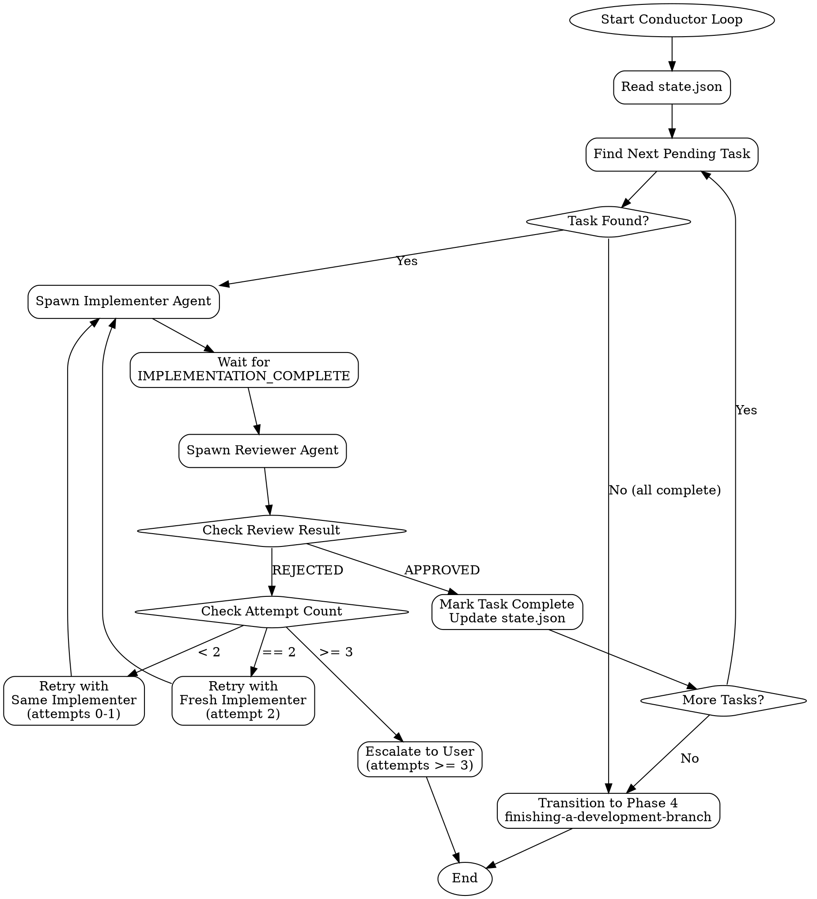

# Conductor Skill

## Overview

The conductor orchestrates Phase 3 (Implementation) of the workflow. Its responsibilities:

1. **Read state** - Load `state.json` to understand current progress
2. **Find next task** - Identify the next pending task from the plan
3. **Spawn implementer** - Launch a Task agent to implement the current task
4. **Spawn reviewer** - Launch a Task agent to review the implementation
5. **Handle retries** - Manage failed reviews with progressive retry logic
6. **Advance workflow** - Mark tasks complete and move to next, or transition to Phase 4

The conductor runs in a loop until all tasks are complete or escalation is required.

## Loop Flow



## State Management

The conductor reads and updates `state.json` throughout the implementation loop.

### Example State Structure

```json
{
  "workflow_id": "feature-auth-system",
  "phase": "implementation",
  "current_task": "task-002",
  "tasks": [
    {
      "id": "task-001",
      "title": "Create user model",
      "status": "completed",
      "attempts": 1,
      "implementer_commits": ["abc1234"],
      "files_changed": ["src/models/user.ts"],
      "test_file": "tests/models/user.test.ts"
    },
    {
      "id": "task-002",
      "title": "Implement authentication service",
      "status": "in_progress",
      "attempts": 1,
      "feedback": []
    },
    {
      "id": "task-003",
      "title": "Add login endpoint",
      "status": "pending",
      "attempts": 0
    }
  ],
  "created_at": "2026-01-25T10:00:00Z",
  "updated_at": "2026-01-25T14:30:00Z"
}
```

### Key State Fields

| Field | Purpose |
|-------|---------|
| `phase` | Current workflow phase (`planning`, `implementation`, `completion`) |
| `current_task` | ID of task currently being worked on |
| `tasks[].status` | Task status: `pending`, `in_progress`, `completed`, `escalated` |
| `tasks[].attempts` | Number of implementation attempts for retry logic |
| `tasks[].feedback` | Array of reviewer feedback from rejected attempts |

## Spawning Implementer

When a pending task is found, spawn an implementer agent using the Task tool.

### Implementer Prompt Template

```markdown
## Implementation Task

You are implementing a task from the workflow plan.

### Task Details

**Task ID:** {{task.id}}
**Title:** {{task.title}}
**Description:**
{{task.description}}

**Acceptance Criteria:**
{{task.acceptance_criteria}}

### Reference Documents

Review these documents before implementing:

{{#each reference_docs}}
- `{{this.path}}`: {{this.description}}
{{/each}}

### Previous Attempts (if any)

{{#if previous_feedback}}
This task has been attempted before. Learn from the reviewer feedback:

{{#each previous_feedback}}
**Attempt {{@index + 1}} Feedback:**
{{this.summary}}

Issues identified:
{{#each this.issues}}
- {{this}}
{{/each}}
{{/each}}
{{/if}}

### Instructions

1. **Read documentation** - Review all reference docs and related code
2. **Use TDD approach** - Write tests first, then implementation
3. **Follow project conventions** - Match existing code style and patterns
4. **Make atomic commits** - One logical change per commit
5. **Run tests** - Ensure all tests pass before completing

### Output

When implementation is complete, output exactly:

```
IMPLEMENTATION_COMPLETE
commits: [list of commit hashes]
files_changed: [list of modified files]
test_file: [path to test file]
```

If you encounter blockers you cannot resolve, output:

```
IMPLEMENTATION_BLOCKED
reason: [explanation of blocker]
```
```

### Task Tool Invocation

```javascript
// Spawn implementer agent
Task({
  description: `Implement task: ${task.title}`,
  prompt: renderImplementerPrompt(task, referenceDocs, previousFeedback)
});
```

## Spawning Reviewer

After the implementer signals completion, spawn a reviewer agent.

### Reviewer Prompt Template

```markdown
## Code Review Task

You are reviewing an implementation for the workflow.

### Task Specification

**Task ID:** {{task.id}}
**Title:** {{task.title}}
**Description:**
{{task.description}}

**Acceptance Criteria:**
{{task.acceptance_criteria}}

### Implementation Details

**Commits:** {{commits}}
**Files Changed:**
{{#each files_changed}}
- `{{this}}`
{{/each}}

**Test File:** `{{test_file}}`

### Review Checklist

Verify each item:

- [ ] **Functionality** - Implementation meets acceptance criteria
- [ ] **Tests** - Test coverage is adequate and tests pass
- [ ] **Code Quality** - Code is clean, readable, follows conventions
- [ ] **No Regressions** - Existing functionality not broken
- [ ] **Documentation** - Code is appropriately documented
- [ ] **Security** - No obvious security issues introduced

### Instructions

1. Read the task specification carefully
2. Review all changed files and commits
3. Run the tests and verify they pass
4. Check each item on the review checklist
5. Provide detailed feedback

### Output

If the implementation is acceptable, output:

```
APPROVED
summary: [brief summary of what was implemented]
```

If the implementation needs changes, output:

```
REJECTED
summary: [overall assessment]
issues:
- [specific issue 1]
- [specific issue 2]
suggestions:
- [actionable suggestion 1]
- [actionable suggestion 2]
```
```

### Task Tool Invocation

```javascript
// Spawn reviewer agent
Task({
  description: `Review implementation: ${task.title}`,
  prompt: renderReviewerPrompt(task, implementationDetails)
});
```

## Retry Logic

When a review is rejected, apply progressive retry logic based on attempt count.

| Attempts | Strategy | Rationale |
|----------|----------|-----------|
| 0-1 | Same implementer with feedback | Minor issues, same context helpful |
| 2 | Fresh implementer | New perspective may solve persistent issues |
| 3+ | Escalate to user | Likely needs human judgment or clarification |

### Retry Implementation

```javascript
function handleRejection(task, feedback) {
  task.attempts++;
  task.feedback.push(feedback);

  if (task.attempts < 2) {
    // Retry with same implementer, include feedback
    return { action: 'retry_same', feedback };
  } else if (task.attempts === 2) {
    // Fresh start with new implementer
    return { action: 'retry_fresh', allFeedback: task.feedback };
  } else {
    // Escalate to user
    task.status = 'escalated';
    return { action: 'escalate', reason: 'Max retries exceeded', feedback: task.feedback };
  }
}
```

### Feedback Accumulation

Each rejected attempt's feedback is preserved:

```json
{
  "feedback": [
    {
      "attempt": 1,
      "summary": "Missing error handling",
      "issues": ["No try-catch around API call", "Missing validation"],
      "suggestions": ["Wrap in try-catch", "Add input validation"]
    },
    {
      "attempt": 2,
      "summary": "Tests incomplete",
      "issues": ["No edge case tests", "Missing mock for external service"],
      "suggestions": ["Add tests for empty input", "Mock the auth service"]
    }
  ]
}
```

## State Updates

Update `state.json` at each stage of the loop.

### Starting a Task (in_progress)

```json
{
  "current_task": "task-002",
  "tasks": [
    {
      "id": "task-002",
      "status": "in_progress",
      "attempts": 1,
      "started_at": "2026-01-25T14:30:00Z"
    }
  ]
}
```

### Completing a Task (completed)

```json
{
  "tasks": [
    {
      "id": "task-002",
      "status": "completed",
      "attempts": 1,
      "implementer_commits": ["def5678", "ghi9012"],
      "files_changed": ["src/services/auth.ts", "src/middleware/auth.ts"],
      "test_file": "tests/services/auth.test.ts",
      "completed_at": "2026-01-25T15:45:00Z"
    }
  ]
}
```

### Phase Completion

When all tasks are complete:

```json
{
  "phase": "completion",
  "current_task": null,
  "tasks": [
    { "id": "task-001", "status": "completed" },
    { "id": "task-002", "status": "completed" },
    { "id": "task-003", "status": "completed" }
  ],
  "implementation_completed_at": "2026-01-25T16:00:00Z"
}
```

## Transition to Phase 4

When all tasks are completed, transition to the completion phase.

### Transition Steps

1. **Verify all tasks complete**
   ```javascript
   const allComplete = state.tasks.every(t => t.status === 'completed');
   ```

2. **Update state phase**
   ```json
   {
     "phase": "completion",
     "implementation_completed_at": "2026-01-25T16:00:00Z"
   }
   ```

3. **Invoke finishing skill**
   ```
   Use the Skill tool to invoke: finishing-a-development-branch
   ```

4. **Provide summary**
   ```markdown
   ## Implementation Complete

   All {{task_count}} tasks have been implemented and reviewed.

   ### Summary
   - Tasks completed: {{completed_count}}
   - Total commits: {{commit_count}}
   - Files changed: {{files_changed_count}}

   Transitioning to Phase 4: Finishing the development branch.
   ```

## Error Recovery

Handle errors gracefully to maintain workflow integrity.

| Error | Detection | Recovery Action |
|-------|-----------|-----------------|
| State file missing | File read fails | Create new state from plan, warn user |
| State file corrupt | JSON parse fails | Attempt backup recovery, or reinitialize |
| Implementer timeout | Task exceeds time limit | Mark attempt failed, retry with fresh agent |
| Implementer blocked | `IMPLEMENTATION_BLOCKED` output | Log blocker, escalate to user immediately |
| Reviewer timeout | Task exceeds time limit | Retry review with fresh agent |
| Invalid task reference | Task ID not in state | Log error, skip to next valid task |
| Git conflicts | Commit/merge fails | Pause workflow, notify user for resolution |

### Error Handling Implementation

```javascript
async function conductorLoop() {
  try {
    const state = await readState();

    while (true) {
      const task = findNextPendingTask(state);

      if (!task) {
        // All tasks complete
        await transitionToPhase4(state);
        break;
      }

      try {
        await executeTask(task, state);
      } catch (error) {
        if (error.type === 'BLOCKED') {
          await escalateToUser(task, error.reason);
          break;
        }
        // Log and continue to next task or retry
        console.error(`Task ${task.id} failed:`, error);
        await handleTaskError(task, error, state);
      }

      await saveState(state);
    }
  } catch (error) {
    console.error('Conductor loop failed:', error);
    await notifyUser('Workflow paused due to error', error);
  }
}
```

### State Backup

Before critical operations, create state backups:

```javascript
async function saveState(state) {
  // Backup current state
  const backupPath = `${statePath}.backup`;
  await copyFile(statePath, backupPath);

  // Write new state
  state.updated_at = new Date().toISOString();
  await writeFile(statePath, JSON.stringify(state, null, 2));
}
```
