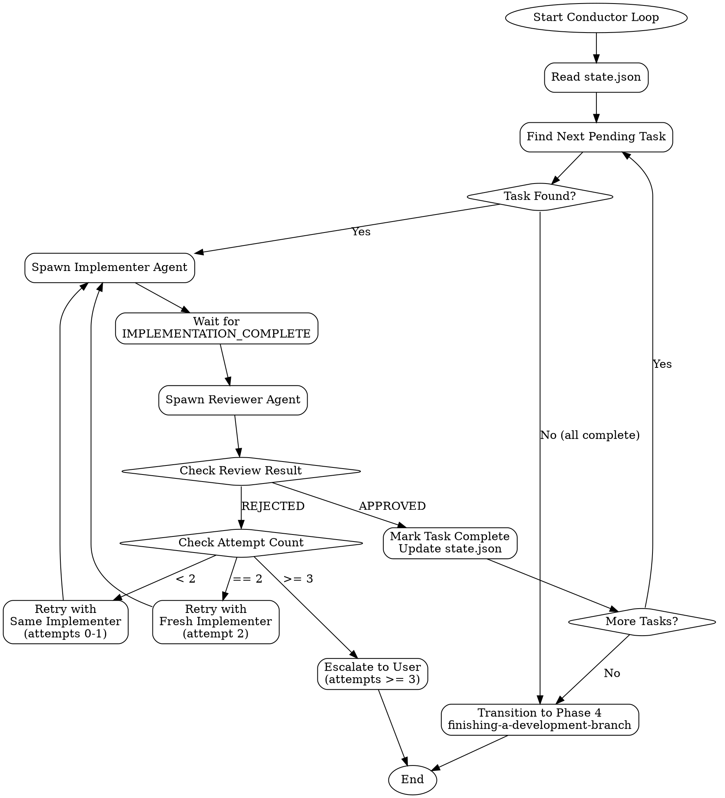

# Conductor Skill

## Overview

The conductor orchestrates Phase 3 (Implementation) of the workflow. Its responsibilities:

1. **Read state** - Load `state.json` to understand current progress
2. **Find next task** - Identify the next pending task from the plan
3. **Spawn implementer** - Launch a Task agent to implement the current task
4. **Spawn reviewer** - Launch a Task agent to review the implementation
5. **Handle retries** - Manage failed reviews with progressive retry logic
6. **Advance workflow** - Mark tasks complete and move to next, or transition to Phase 4

The conductor runs in a loop until all tasks are complete or escalation is required.

## Loop Flow



## State Management

The conductor reads and updates `state.json` throughout the implementation loop.

### Example State Structure

```json
{
  "workflow_id": "feature-auth-system",
  "phase": "implementation",
  "current_task": "task-002",
  "spec_paths": {
    "prd": "docs/specs/PRD.md",
    "adr": "docs/specs/ADR.md",
    "technical_design": "docs/specs/TECHNICAL_DESIGN.md",
    "wireframes": "docs/specs/WIREFRAMES.md"
  },
  "tasks_dir": "docs/tasks",
  "tasks": [
    {
      "id": "task-001",
      "title": "Create user model",
      "status": "completed",
      "attempts": 1,
      "implementer_commits": ["abc1234"],
      "files_changed": ["src/models/user.ts"],
      "test_file": "tests/models/user.test.ts"
    },
    {
      "id": "task-002",
      "title": "Implement authentication service",
      "status": "in_progress",
      "attempts": 1,
      "started_at": "2026-01-25T14:30:00Z",
      "feedback": []
    },
    {
      "id": "task-003",
      "title": "Add login endpoint",
      "status": "pending",
      "attempts": 0
    }
  ],
  "created_at": "2026-01-25T10:00:00Z",
  "updated_at": "2026-01-25T14:30:00Z",
  "config": {
    "timeout_minutes": 30,
    "max_identical_rejections": 3,
    "max_iterations_without_progress": 3
  }
}
```

### Key State Fields

| Field | Purpose |
|-------|---------|
| `phase` | Current workflow phase (`planning`, `implementation`, `completion`) |
| `current_task` | ID of task currently being worked on |
| `spec_paths` | Explicit paths to spec documents (PRD, ADR, technical_design, wireframes) |
| `tasks_dir` | Directory containing task files (e.g., `docs/tasks`) |
| `tasks[].status` | Task status: `pending`, `in_progress`, `completed`, `escalated` |
| `tasks[].attempts` | Number of implementation attempts for retry logic |
| `tasks[].feedback` | Array of reviewer feedback from rejected attempts |

## Skill Invocation Logging

Track all skill invocations in `state.json` for visibility and debugging:

```json
{
  "skill_log": [
    {"skill": "homerun:discovery", "timestamp": "2026-01-25T10:00:00Z", "phase": "discovery"},
    {"skill": "homerun:planning", "timestamp": "2026-01-25T11:00:00Z", "phase": "planning"},
    {"skill": "homerun:tdd", "timestamp": "2026-01-25T12:00:00Z", "phase": "implementing", "task": "001"},
    {"skill": "homerun:implement", "timestamp": "2026-01-25T12:05:00Z", "phase": "implementing", "task": "001"},
    {"skill": "homerun:review", "timestamp": "2026-01-25T12:30:00Z", "phase": "implementing", "task": "001"}
  ]
}
```

### Logging Protocol

**When spawning any agent, log the invocation:**

```javascript
function logSkillInvocation(state, skillName, taskId = null) {
  const entry = {
    skill: skillName,
    timestamp: new Date().toISOString(),
    phase: state.phase
  };
  if (taskId) {
    entry.task = taskId;
  }
  state.skill_log = state.skill_log || [];
  state.skill_log.push(entry);
}

// Usage before spawning implementer:
logSkillInvocation(state, "homerun:implement", task.id);
logSkillInvocation(state, "homerun:tdd", task.id);

// Usage before spawning reviewer:
logSkillInvocation(state, "homerun:review", task.id);
```

This provides visibility into which skills are invoked and helps identify missing skills that should be cloned.

---

## Pre-Spawn Verification

**REQUIRED:** Before spawning any agent, verify the git state is clean:

```bash
cd "$WORKTREE_PATH"

# Check for uncommitted changes
if [[ -n $(git status --porcelain) ]]; then
  echo "ERROR: Working tree has uncommitted changes"
  git status --short
  echo "Aborting agent spawn - resolve uncommitted changes first"
  exit 1
fi

# Verify correct branch
current_branch=$(git branch --show-current)
expected_branch=$(jq -r '.branch' state.json)
if [[ "$current_branch" != "$expected_branch" ]]; then
  echo "ERROR: On branch $current_branch, expected $expected_branch"
  echo "Switching to correct branch..."
  git checkout "$expected_branch"
fi

# Pull latest changes if remote exists
if git remote get-url origin &>/dev/null; then
  git pull --rebase origin "$expected_branch" 2>/dev/null || true
fi
```

---

## Timeout Detection

Track agent execution time and fail if it exceeds the configured limit.

### Timeout Tracking

When spawning an agent, record the start time in state.json:

```json
{
  "current_task": "task-002",
  "tasks": [
    {
      "id": "task-002",
      "status": "in_progress",
      "started_at": "2026-01-25T14:30:00Z",
      "timeout_at": "2026-01-25T15:00:00Z"
    }
  ]
}
```

### Timeout Check

Before processing agent output, verify the task hasn't timed out:

```javascript
function checkTimeout(task, config) {
  const startedAt = new Date(task.started_at);
  const timeoutMinutes = config.timeout_minutes || 30;
  const timeoutAt = new Date(startedAt.getTime() + timeoutMinutes * 60 * 1000);

  if (new Date() > timeoutAt) {
    return {
      timedOut: true,
      duration: Math.round((new Date() - startedAt) / 60000),
      limit: timeoutMinutes
    };
  }
  return { timedOut: false };
}
```

### Timeout Response

If a task times out:
1. Mark the current attempt as failed with reason "timeout"
2. Increment attempt counter
3. Follow retry logic (same agent → fresh agent → escalate)
4. Log the timeout in feedback array

---

## Deadlock Detection

Detect when the implementation loop is stuck without progress.

### Deadlock Indicators

| Indicator | Detection | Threshold |
|-----------|-----------|-----------|
| Identical rejections | Same task rejected with identical feedback hash | 3 consecutive |
| No progress | No tasks completed in N iterations | 3 iterations |
| Circular rejection | Task A rejected, then Task B rejected citing Task A | 2 occurrences |

### Identical Rejection Detection

```javascript
function detectIdenticalRejections(task) {
  if (!task.feedback || task.feedback.length < 2) return false;

  // Hash feedback for comparison
  const hashFeedback = (fb) => JSON.stringify(fb.issues?.sort() || []);

  const recentHashes = task.feedback.slice(-3).map(hashFeedback);
  const uniqueHashes = new Set(recentHashes);

  if (recentHashes.length >= 3 && uniqueHashes.size === 1) {
    return {
      deadlocked: true,
      reason: "Same rejection feedback received 3+ times",
      feedback: task.feedback[task.feedback.length - 1]
    };
  }
  return { deadlocked: false };
}
```

### Progress Tracking

Track completed tasks per iteration:

```json
{
  "progress": {
    "iteration": 5,
    "tasks_completed_this_iteration": 0,
    "last_completion_iteration": 2
  }
}
```

```javascript
function detectNoProgress(state) {
  const config = state.config || {};
  const maxIterationsWithoutProgress = config.max_iterations_without_progress || 3;

  const iterationsSinceProgress =
    state.progress.iteration - state.progress.last_completion_iteration;

  if (iterationsSinceProgress >= maxIterationsWithoutProgress) {
    return {
      deadlocked: true,
      reason: `No tasks completed in ${iterationsSinceProgress} iterations`,
      stalled_tasks: state.tasks.filter(t => t.status === 'in_progress')
    };
  }
  return { deadlocked: false };
}
```

### Deadlock Response

If deadlock is detected:
1. **Do not continue** the implementation loop
2. Mark workflow as `needs_intervention`
3. Present detailed deadlock report to user:
   - Which task(s) are stuck
   - What feedback has been repeated
   - Suggested actions (simplify task, split task, clarify requirements)
4. Wait for user guidance before continuing

---

## Spawning Implementer

When a pending task is found, spawn an implementer agent using the Task tool.

### Loading Spec Paths from State

Before spawning agents, load the explicit spec paths from `state.json`:

```bash
cd "$WORKTREE_PATH"

# Load spec paths from state.json
TECHNICAL_DESIGN_PATH=$(jq -r '.spec_paths.technical_design // "docs/specs/TECHNICAL_DESIGN.md"' state.json)
ADR_PATH=$(jq -r '.spec_paths.adr // "docs/specs/ADR.md"' state.json)
PRD_PATH=$(jq -r '.spec_paths.prd // "docs/specs/PRD.md"' state.json)
TASKS_DIR=$(jq -r '.tasks_dir // "docs/tasks"' state.json)

# Verify paths exist
for path in "$TECHNICAL_DESIGN_PATH" "$ADR_PATH"; do
  if [[ ! -f "$path" ]]; then
    echo "WARNING: Spec file not found: $path"
  fi
done
```

### Constructing JSON Input for Implementer

Build the JSON input object from state and task file:

```javascript
function buildImplementerInput(state, task) {
  return {
    task: {
      id: task.id,
      title: task.title,
      objective: task.objective,
      acceptance_criteria: task.acceptance_criteria.map(ac => ({
        id: ac.id,
        criterion: ac.criterion
      })),
      test_file: task.test_file
    },
    spec_paths: {
      technical_design: state.spec_paths.technical_design,
      adr: state.spec_paths.adr
    },
    previous_feedback: task.feedback || [],
    worktree_path: state.worktree
  };
}
```

### Implementer Prompt Template

```markdown
## Implementation Task

You are implementing a task from the workflow plan. Use the `homerun:implement` skill.

### Input (JSON)

\`\`\`json
{{implementer_input_json}}
\`\`\`

### Instructions

1. **Validate the input** - Check all required fields are present
2. **Read the task** - Understand objective and acceptance criteria
3. **Read reference docs** - Use paths from `spec_paths`
4. **Use TDD** - Invoke `homerun:tdd` for all implementation
5. **Output JSON** - Return one of: `IMPLEMENTATION_COMPLETE`, `IMPLEMENTATION_BLOCKED`, or `VALIDATION_ERROR`

### Output Format

Your final output MUST be a valid JSON object in a code block:

\`\`\`json
{
  "signal": "IMPLEMENTATION_COMPLETE",
  "files_changed": [...],
  "test_file": "...",
  "commit_hash": "...",
  "acceptance_criteria_met": [...]
}
\`\`\`
```

### Task Tool Invocation

```javascript
// Build JSON input
const implementerInput = buildImplementerInput(state, task);

// Log skill invocation
logSkillInvocation(state, "homerun:implement", task.id);

// Determine model: use task.model (default: sonnet), or escalated_model if set
const implementerModel = task.escalated_model || task.model || "sonnet";

// Spawn implementer agent with appropriate model
Task({
  description: `Implement task: ${task.title}`,
  prompt: `Use the homerun:implement skill.\n\nInput:\n\`\`\`json\n${JSON.stringify(implementerInput, null, 2)}\n\`\`\``,
  model: implementerModel  // haiku for simple tasks, sonnet for complex or escalated
});
```

## Spawning Reviewer

After the implementer signals completion, spawn a reviewer agent.

### Parsing Implementer Output

Parse the JSON output from the implementer:

```javascript
function parseImplementerOutput(output) {
  // Find JSON block in output
  const jsonMatch = output.match(/```json\s*([\s\S]*?)\s*```/);
  if (!jsonMatch) {
    throw new Error("No JSON output found in implementer response");
  }

  const result = JSON.parse(jsonMatch[1]);

  // Validate signal
  const validSignals = ["IMPLEMENTATION_COMPLETE", "IMPLEMENTATION_BLOCKED", "VALIDATION_ERROR"];
  if (!validSignals.includes(result.signal)) {
    throw new Error(`Invalid signal: ${result.signal}`);
  }

  return result;
}
```

### Constructing JSON Input for Reviewer

Build the JSON input from state, task, and implementer output:

```javascript
function buildReviewerInput(state, task, implementerOutput) {
  return {
    task: {
      id: task.id,
      title: task.title,
      acceptance_criteria: task.acceptance_criteria.map(ac => ({
        id: ac.id,
        criterion: ac.criterion
      }))
    },
    implementation: {
      commit_hash: implementerOutput.commit_hash,
      files_changed: implementerOutput.files_changed,
      test_file: implementerOutput.test_file
    },
    spec_paths: {
      technical_design: state.spec_paths.technical_design,
      adr: state.spec_paths.adr
    },
    worktree_path: state.worktree
  };
}
```

### Reviewer Prompt Template

```markdown
## Code Review Task

You are reviewing an implementation for the workflow. Use the `homerun:review` skill.

### Input (JSON)

\`\`\`json
{{reviewer_input_json}}
\`\`\`

### Instructions

1. **Validate the input** - Check all required fields are present
2. **Review the implementation** - Check files, tests, and commit
3. **Verify acceptance criteria** - Each criterion should have implementation and test
4. **Output JSON** - Return one of: `APPROVED`, `REJECTED`, or `VALIDATION_ERROR`

### Output Format

Your final output MUST be a valid JSON object in a code block:

\`\`\`json
{
  "signal": "APPROVED",
  "summary": "...",
  "verified": [...]
}
\`\`\`
```

### Task Tool Invocation

```javascript
// Parse implementer output
const implementerResult = parseImplementerOutput(implementerRawOutput);

// Handle blocked or validation error
if (implementerResult.signal !== "IMPLEMENTATION_COMPLETE") {
  return handleImplementerFailure(task, implementerResult);
}

// Build JSON input for reviewer
const reviewerInput = buildReviewerInput(state, task, implementerResult);

// Log skill invocation
logSkillInvocation(state, "homerun:review", task.id);

// Spawn reviewer agent - ALWAYS use sonnet for reviews
// Sonnet provides better judgment for acceptance criteria verification
Task({
  description: `Review implementation: ${task.title}`,
  prompt: `Use the homerun:review skill.\n\nInput:\n\`\`\`json\n${JSON.stringify(reviewerInput, null, 2)}\n\`\`\``,
  model: "sonnet"  // Reviews always use sonnet for quality assurance
});
```

### Parsing Reviewer Output

```javascript
function parseReviewerOutput(output) {
  const jsonMatch = output.match(/```json\s*([\s\S]*?)\s*```/);
  if (!jsonMatch) {
    throw new Error("No JSON output found in reviewer response");
  }

  const result = JSON.parse(jsonMatch[1]);

  const validSignals = ["APPROVED", "REJECTED", "VALIDATION_ERROR"];
  if (!validSignals.includes(result.signal)) {
    throw new Error(`Invalid signal: ${result.signal}`);
  }

  return result;
}
```

### Handling Review Results

```javascript
function handleReviewResult(state, task, reviewResult) {
  if (reviewResult.signal === "APPROVED") {
    // Mark task complete, update state
    task.status = "completed";
    task.completed_at = new Date().toISOString();
    task.verified = reviewResult.verified;
    return { action: "next_task" };
  }

  if (reviewResult.signal === "REJECTED") {
    // Store feedback, increment attempts
    task.feedback = task.feedback || [];
    task.feedback.push({
      attempt: task.attempts,
      summary: reviewResult.summary,
      issues: reviewResult.issues,
      required_fixes: reviewResult.required_fixes
    });
    return handleRejection(task, reviewResult);
  }

  if (reviewResult.signal === "VALIDATION_ERROR") {
    // Log error, retry with corrected input
    console.error("Reviewer validation error:", reviewResult.errors);
    return { action: "fix_input", errors: reviewResult.errors };
  }
}
```

---

## Legacy Reviewer Prompt (Deprecated)

The following template is deprecated but kept for reference:

```markdown
## Code Review Task (Legacy Format)

Use these exact paths (relative to worktree root) to verify alignment with specifications:

- `{{spec_paths.technical_design}}`: Architecture and implementation patterns
- `{{spec_paths.adr}}`: Architectural decisions and constraints

### Review Checklist

Verify each item:

- [ ] **Functionality** - Implementation meets acceptance criteria
- [ ] **Tests** - Test coverage is adequate and tests pass
- [ ] **Code Quality** - Code is clean, readable, follows conventions
- [ ] **No Regressions** - Existing functionality not broken
- [ ] **Documentation** - Code is appropriately documented
- [ ] **Security** - No obvious security issues introduced

### Instructions

1. Read the task specification carefully
2. Review all changed files and commits
3. Run the tests and verify they pass
4. Check each item on the review checklist
5. Provide detailed feedback

### Output

If the implementation is acceptable, output:

```
APPROVED
summary: [brief summary of what was implemented]
```

If the implementation needs changes, output:

```
REJECTED
summary: [overall assessment]
issues:
- [specific issue 1]
- [specific issue 2]
suggestions:
- [actionable suggestion 1]
- [actionable suggestion 2]
```
```

### Task Tool Invocation

```javascript
// Spawn reviewer agent
Task({
  description: `Review implementation: ${task.title}`,
  prompt: renderReviewerPrompt(task, implementationDetails)
});
```

## Retry Logic

When a review is rejected, apply progressive retry logic based on attempt count.

| Attempts | Strategy | Rationale |
|----------|----------|-----------|
| 0-1 | Same implementer with feedback | Minor issues, same context helpful |
| 2 | Fresh implementer | New perspective may solve persistent issues |
| 3+ | Escalate to user | Likely needs human judgment or clarification |

### Retry Implementation

```javascript
function handleRejection(task, feedback) {
  task.attempts++;
  task.feedback.push(feedback);

  // Check for high-severity issues - escalate model to sonnet
  const hasHighSeverity = feedback.issues?.some(issue => issue.severity === "high");
  if (hasHighSeverity && task.model === "haiku") {
    task.escalated_model = "sonnet";
    console.log(`High-severity rejection: escalating ${task.id} from haiku to sonnet`);
  }

  if (task.attempts < 2) {
    // Retry with same implementer, include feedback
    // If escalated_model is set, next spawn will use sonnet
    return { action: 'retry_same', feedback, model: task.escalated_model || task.model };
  } else if (task.attempts === 2) {
    // Fresh start with new implementer (always sonnet for fresh attempts)
    task.escalated_model = "sonnet";
    return { action: 'retry_fresh', allFeedback: task.feedback, model: "sonnet" };
  } else {
    // Escalate to user
    task.status = 'escalated';
    return { action: 'escalate', reason: 'Max retries exceeded', feedback: task.feedback };
  }
}
```

### Feedback Accumulation

Each rejected attempt's feedback is preserved:

```json
{
  "feedback": [
    {
      "attempt": 1,
      "summary": "Missing error handling",
      "issues": ["No try-catch around API call", "Missing validation"],
      "suggestions": ["Wrap in try-catch", "Add input validation"]
    },
    {
      "attempt": 2,
      "summary": "Tests incomplete",
      "issues": ["No edge case tests", "Missing mock for external service"],
      "suggestions": ["Add tests for empty input", "Mock the auth service"]
    }
  ]
}
```

## Model Routing Strategy

The conductor uses different models for different roles and escalates on failures.

### Role-Based Model Assignment

| Role | Model | Rationale |
|------|-------|-----------|
| Implementer (simple tasks) | haiku | Fast, cost-effective for add_field, add_method, refactor |
| Implementer (complex tasks) | sonnet | Better reasoning for create_model, create_service, bug_fix |
| Reviewer | sonnet (always) | Quality assurance requires stronger judgment |

### Task Model Selection

The planning phase assigns `model` to each task based on `task_type`:

```javascript
// Model comes from task.model field (set by planning skill)
const implementerModel = task.escalated_model || task.model || "sonnet";
```

### Escalation on High-Severity Rejection

When a reviewer rejects with `severity: "high"` issues:

1. **Detect**: Check if any `issue.severity === "high"`
2. **Escalate**: Set `task.escalated_model = "sonnet"`
3. **Retry**: Next implementation attempt uses sonnet instead of haiku

```javascript
// In handleRejection:
const hasHighSeverity = feedback.issues?.some(issue => issue.severity === "high");
if (hasHighSeverity && task.model === "haiku") {
  task.escalated_model = "sonnet";
}
```

### Escalation Flow

```
haiku implements → sonnet reviews → REJECTED (high severity)
                                         ↓
                               sonnet re-implements → sonnet reviews
```

This ensures:
- Simple tasks stay fast and cheap with haiku
- Complex issues get escalated to sonnet automatically
- Reviews always have sonnet-level quality assurance

---

## State Updates

Update `state.json` at each stage of the loop.

### Starting a Task (in_progress)

```json
{
  "current_task": "task-002",
  "tasks": [
    {
      "id": "task-002",
      "status": "in_progress",
      "attempts": 1,
      "started_at": "2026-01-25T14:30:00Z"
    }
  ]
}
```

### Completing a Task (completed)

```json
{
  "tasks": [
    {
      "id": "task-002",
      "status": "completed",
      "attempts": 1,
      "implementer_commits": ["def5678", "ghi9012"],
      "files_changed": ["src/services/auth.ts", "src/middleware/auth.ts"],
      "test_file": "tests/services/auth.test.ts",
      "completed_at": "2026-01-25T15:45:00Z"
    }
  ]
}
```

### Task Completion Validation Gate

**REQUIRED:** Before marking a task as completed, verify these conditions:

#### 1. Test Suite Execution

```bash
cd "$WORKTREE_PATH"

# Get the test file from the task
test_file=$(grep "^test_file:" "docs/tasks/${TASK_ID}-*.md" | sed 's/test_file: *//')

# Run the specific test file and capture result
if [[ -n "$test_file" ]] && [[ "$test_file" != "null" ]]; then
  # Detect test runner
  if [[ -f "package.json" ]]; then
    npm test -- "$test_file" 2>&1 || echo "VALIDATION_FAILED: Tests failed for $test_file"
  elif [[ -f "pytest.ini" ]] || [[ -f "pyproject.toml" ]]; then
    pytest "$test_file" 2>&1 || echo "VALIDATION_FAILED: Tests failed for $test_file"
  elif [[ -f "Cargo.toml" ]]; then
    cargo test 2>&1 || echo "VALIDATION_FAILED: Tests failed"
  else
    echo "VALIDATION_WARNING: Could not detect test runner"
  fi
fi
```

#### 2. Git State Verification

```bash
# Verify working tree is clean
if [[ -n $(git status --porcelain) ]]; then
  echo "VALIDATION_FAILED: Working tree has uncommitted changes"
  git status --short
fi

# Verify we're on the correct branch
current_branch=$(git branch --show-current)
expected_branch=$(jq -r '.branch' state.json)
if [[ "$current_branch" != "$expected_branch" ]]; then
  echo "VALIDATION_FAILED: On branch $current_branch, expected $expected_branch"
fi
```

#### 3. Commit Message Validation

```bash
# Get the latest commit message
last_commit_msg=$(git log -1 --pretty=%B)

# Validate conventional commit format: feat(<feature>): <description>
if ! echo "$last_commit_msg" | grep -qE "^(feat|fix|docs|refactor|test|chore)\([a-z-]+\): .+"; then
  echo "VALIDATION_FAILED: Commit message does not follow format 'feat(<feature>): <description>'"
  echo "Got: $last_commit_msg"
fi
```

#### 4. Mark Task File Checkboxes Complete

**After all validations pass**, update the task file to check off completed items:

```bash
task_file="docs/tasks/${TASK_ID}-*.md"
task_file=$(ls $task_file 2>/dev/null | head -1)

if [[ -f "$task_file" ]]; then
  # Check off all acceptance criteria checkboxes
  sed -i 's/- \[ \]/- [x]/g' "$task_file"

  # Update frontmatter status to completed
  sed -i 's/^status: .*/status: completed/' "$task_file"

  # Add completion timestamp if not present
  if ! grep -q "^completed_at:" "$task_file"; then
    sed -i "/^status: completed/a completed_at: $(date -Iseconds)" "$task_file"
  fi

  # Commit the task file update
  git add "$task_file"
  git commit -m "chore(${FEATURE}): mark task ${TASK_ID} complete

- All acceptance criteria verified
- Tests passing
- Task file checkboxes checked"

  echo "Task file updated: $task_file"
fi
```

**Verification:**
```bash
# Confirm all checkboxes are checked
unchecked=$(grep -c '\- \[ \]' "$task_file" 2>/dev/null || echo "0")
if [[ "$unchecked" -gt 0 ]]; then
  echo "WARNING: $unchecked unchecked items remain in $task_file"
fi
```

#### Validation Response

If any validation fails:
1. **Do not mark task as completed**
2. Return to implementer with specific failure reason
3. Increment attempt counter
4. Follow retry logic

### Phase Completion

When all tasks are complete:

```json
{
  "phase": "completion",
  "current_task": null,
  "tasks": [
    { "id": "task-001", "status": "completed" },
    { "id": "task-002", "status": "completed" },
    { "id": "task-003", "status": "completed" }
  ],
  "implementation_completed_at": "2026-01-25T16:00:00Z"
}
```

## Transition to Phase 4

When all tasks are completed, transition to the completion phase.

### Transition Steps

1. **Verify all tasks complete**
   ```javascript
   const allComplete = state.tasks.every(t => t.status === 'completed');
   ```

2. **Run PRD Verification Gate** (REQUIRED)

   Before transitioning to completion, verify the implementation meets PRD requirements.

   #### 2.1 User Story Coverage

   Check that all user stories have completed tasks:

   ```bash
   cd "$WORKTREE_PATH"

   # Load traceability from state
   stories=$(jq -r '.traceability.user_stories | keys[]' state.json)

   for story_id in $stories; do
     tasks=$(jq -r ".traceability.user_stories[\"$story_id\"].tasks[]" state.json 2>/dev/null)

     if [[ -z "$tasks" ]]; then
       echo "COVERAGE_GAP: $story_id has no implementing tasks"
       continue
     fi

     for task_id in $tasks; do
       status=$(jq -r ".tasks[\"$task_id\"].status" state.json)
       if [[ "$status" != "completed" ]]; then
         echo "COVERAGE_GAP: $story_id task $task_id is $status, not completed"
       fi
     done
   done
   ```

   #### 2.2 Acceptance Criteria Coverage

   Verify all acceptance criteria are addressed:

   ```bash
   # Check each acceptance criterion has a completed task
   criteria=$(jq -r '.traceability.acceptance_criteria | keys[]' state.json)

   for ac_id in $criteria; do
     tasks=$(jq -r ".traceability.acceptance_criteria[\"$ac_id\"].tasks[]" state.json 2>/dev/null)

     if [[ -z "$tasks" ]]; then
       echo "COVERAGE_GAP: $ac_id has no implementing tasks"
     fi
   done
   ```

   #### 2.3 Success Metrics Verification

   Prompt user to measure quantitative metrics:

   ```markdown
   ## Success Metrics Verification

   Please verify the following success metrics from the PRD:

   | ID | Metric | Target | Actual | Status |
   |----|--------|--------|--------|--------|
   | SM-001 | {{metric_name}} | {{target}} | _Enter actual_ | ⏳ Pending |
   | SM-002 | {{metric_name}} | {{target}} | _Enter actual_ | ⏳ Pending |

   For each metric, please provide the actual measured value.
   ```

   #### 2.4 Non-Goal Boundary Check

   Scan for scope creep - flag any task that appears to implement a non-goal:

   ```bash
   # Load non-goals
   non_goals=$(jq -r '.traceability.non_goals[]' state.json)

   # Check task titles and descriptions against non-goals
   for task_file in docs/tasks/*.md; do
     task_content=$(cat "$task_file")

     for non_goal in $non_goals; do
       # Extract keywords from non-goal (e.g., "OAuth", "two-factor")
       keywords=$(echo "$non_goal" | grep -oE '[A-Za-z]{4,}' | tr '[:upper:]' '[:lower:]')

       for keyword in $keywords; do
         if echo "$task_content" | grep -qi "$keyword"; then
           echo "SCOPE_CREEP_WARNING: $task_file may implement non-goal: $non_goal"
         fi
       done
     done
   done
   ```

   #### 2.5 Generate Completion Report

   Create `docs/COMPLETION_REPORT.md` with verification results:

   ```bash
   cat > docs/COMPLETION_REPORT.md << 'EOF'
   # Completion Report: {{FEATURE_NAME}}

   Generated: {{TIMESTAMP}}

   ## Coverage Summary

   | Category | Total | Covered | Coverage |
   |----------|-------|---------|----------|
   | User Stories | {{total_stories}} | {{covered_stories}} | {{story_coverage}}% |
   | Acceptance Criteria | {{total_ac}} | {{covered_ac}} | {{ac_coverage}}% |
   | Tasks | {{total_tasks}} | {{completed_tasks}} | {{task_coverage}}% |

   ## User Story Coverage Matrix

   | Story ID | Title | Tasks | Status |
   |----------|-------|-------|--------|
   {{#each user_stories}}
   | {{id}} | {{title}} | {{tasks}} | {{status}} |
   {{/each}}

   ## Acceptance Criteria Verification

   | AC ID | Description | Task | Verified |
   |-------|-------------|------|----------|
   {{#each acceptance_criteria}}
   | {{id}} | {{description}} | {{task}} | {{verified}} |
   {{/each}}

   ## Success Metrics

   | ID | Metric | Target | Actual | Met? |
   |----|--------|--------|--------|------|
   {{#each success_metrics}}
   | {{id}} | {{name}} | {{target}} | {{actual}} | {{met}} |
   {{/each}}

   ## Scope Verification

   ### Non-Goals Preserved
   {{#each non_goals}}
   - ✅ {{this}}
   {{/each}}

   ### Scope Creep Warnings
   {{#if scope_warnings}}
   {{#each scope_warnings}}
   - ⚠️ {{this}}
   {{/each}}
   {{else}}
   No scope creep detected.
   {{/if}}

   ## Recommendation

   {{#if all_verified}}
   ✅ **Ready for merge.** All user stories implemented, acceptance criteria verified, success metrics met.
   {{else}}
   ⚠️ **Review required.** See gaps above before proceeding.
   {{/if}}
   EOF

   git add docs/COMPLETION_REPORT.md
   git commit -m "docs: add completion verification report"
   ```

   #### Verification Response

   If coverage gaps are found:
   1. Present the gaps to the user
   2. Ask: "Would you like to add tasks to address these gaps, or proceed with partial coverage?"
   3. On "add tasks", return to planning to create missing tasks
   4. On "proceed", continue to Phase 4 with documented gaps

3. **Update state phase**
   ```json
   {
     "phase": "completion",
     "implementation_completed_at": "2026-01-25T16:00:00Z",
     "verification": {
       "story_coverage": 100,
       "ac_coverage": 100,
       "scope_creep_warnings": [],
       "verified_at": "2026-01-25T16:00:00Z"
     }
   }
   ```

4. **Invoke finishing skill**
   ```
   Use the Skill tool to invoke: homerun:finishing-a-development-branch
   ```

5. **Provide summary**
   ```markdown
   ## Implementation Complete

   All {{task_count}} tasks have been implemented and reviewed.

   ### Summary
   - Tasks completed: {{completed_count}}
   - Total commits: {{commit_count}}
   - Files changed: {{files_changed_count}}
   - User Story Coverage: {{story_coverage}}%
   - Acceptance Criteria Coverage: {{ac_coverage}}%

   ### Verification Report
   See `docs/COMPLETION_REPORT.md` for detailed coverage matrix.

   Transitioning to Phase 4: Finishing the development branch.
   ```

## Error Recovery

Handle errors gracefully to maintain workflow integrity.

| Error | Detection | Recovery Action |
|-------|-----------|-----------------|
| State file missing | File read fails | Create new state from plan, warn user |
| State file corrupt | JSON parse fails | Attempt backup recovery, or reinitialize |
| Implementer timeout | Task exceeds time limit | Mark attempt failed, retry with fresh agent |
| Implementer blocked | `IMPLEMENTATION_BLOCKED` output | Log blocker, escalate to user immediately |
| Reviewer timeout | Task exceeds time limit | Retry review with fresh agent |
| Invalid task reference | Task ID not in state | Log error, skip to next valid task |
| Git conflicts | Commit/merge fails | Pause workflow, notify user for resolution |

### Error Handling Implementation

```javascript
async function conductorLoop() {
  try {
    const state = await readState();

    while (true) {
      const task = findNextPendingTask(state);

      if (!task) {
        // All tasks complete
        await transitionToPhase4(state);
        break;
      }

      try {
        await executeTask(task, state);
      } catch (error) {
        if (error.type === 'BLOCKED') {
          await escalateToUser(task, error.reason);
          break;
        }
        // Log and continue to next task or retry
        console.error(`Task ${task.id} failed:`, error);
        await handleTaskError(task, error, state);
      }

      await saveState(state);
    }
  } catch (error) {
    console.error('Conductor loop failed:', error);
    await notifyUser('Workflow paused due to error', error);
  }
}
```

### State Backup

Before critical operations, create state backups:

```javascript
async function saveState(state) {
  // Backup current state
  const backupPath = `${statePath}.backup`;
  await copyFile(statePath, backupPath);

  // Write new state
  state.updated_at = new Date().toISOString();
  await writeFile(statePath, JSON.stringify(state, null, 2));
}
```
